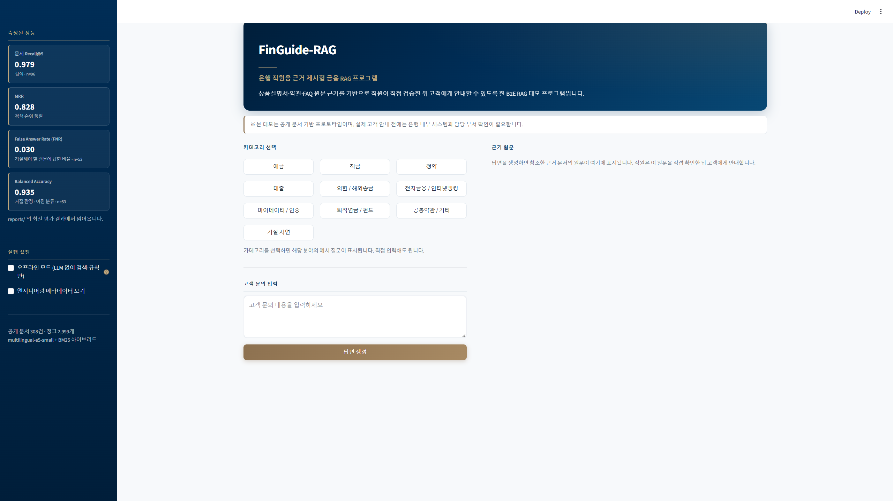
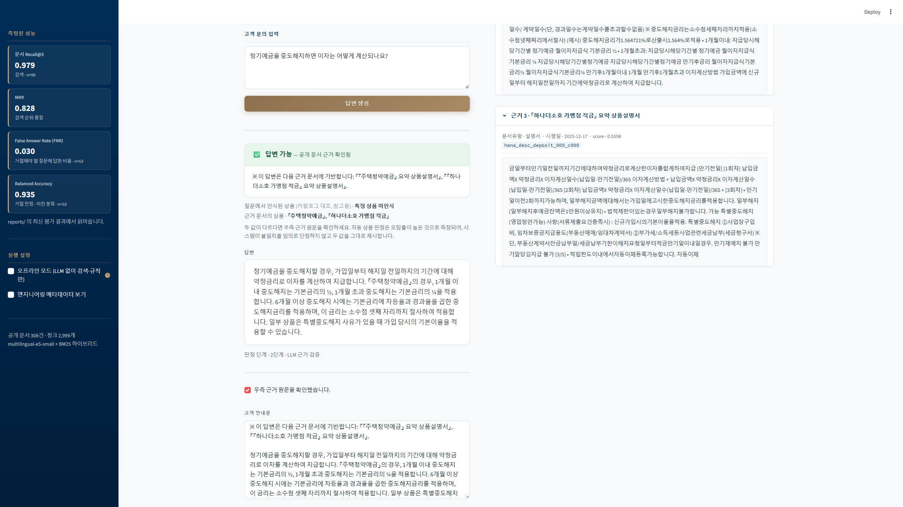
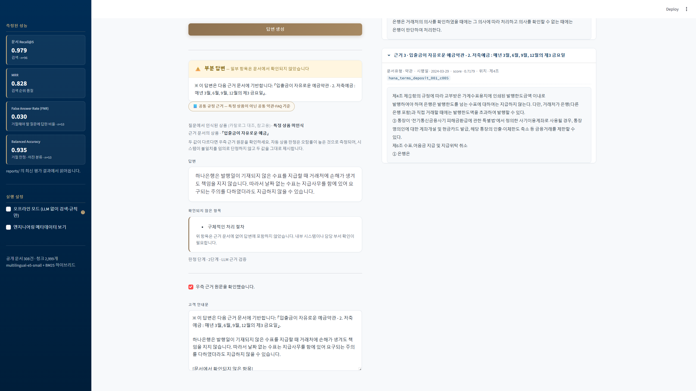
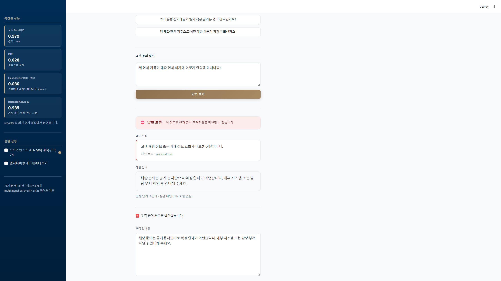
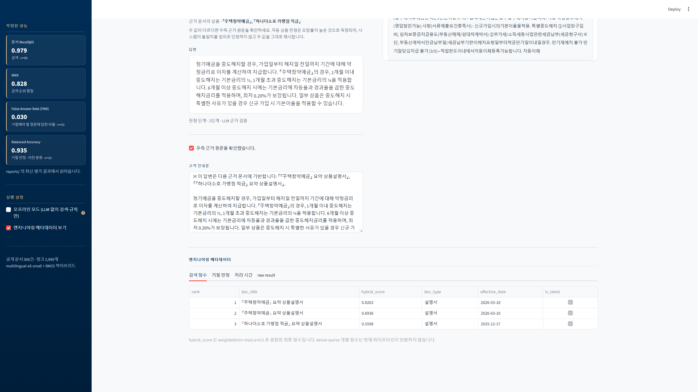

# FinGuide-RAG

> 은행 영업점·고객센터 직원이 **상품설명서·약관·FAQ의 원문 근거**를 바탕으로
> 고객 문의에 정확히 답변하도록 돕는 금융 특화 RAG 시스템 (B2E)


하나은행 공개 문서 **308건**을 정규화해 **2,999개 청크**로 색인하고,
Dense + Sparse 하이브리드 검색으로 **문서 단위 Recall@5 0.979**를 달성했습니다.
근거가 불충분하면 답변을 생성하지 않고 거절하며, 그 판단의 정확도를
**53건 거절 평가셋**으로, 생성 품질을 **96건 평가셋**으로 정량 측정했습니다.

측정 방식은 단계마다 그 분야의 표준을 따릅니다. **검색은 IR 표준 지표,
거절은 이진 분류 표준 지표**로 재고, 생성은 표준 지표가 포착하지 못하는
도메인 오류를 위해 **도메인 특화 오류율과 사람 검수 기반 평가기 보정**을
병행합니다. 표준 RAG 지표(RAGAs 정의를 참고해 재구현)도 세 가지를 대조 측정했으나
금융 상품 정합성 오류를 잡지 못해 주지표로 채택하지 않았고, 그 근거를
6절에 기록했습니다.

---

## 요약

| | |
|---|---|
| **목적** | 은행 직원용 금융 문서 근거 검색·답변 보조 RAG 시스템 (B2E) |
| **데이터** | 하나은행 공개 문서 308건 · 2,999 청크 |
| **핵심 기술** | 구조 기반 청킹 · Dense+Sparse 하이브리드 검색 · 3단계 거절 로직 |
| **검색 성능** | 문서 단위 Recall@5 **0.979** (n=96) |
| **거절 성능** | False Answer Rate **0.030** · Balanced Accuracy **0.935** (n=53) |
| **생성 오류율** | 환각 **0.037** · 상품불일치 **0.058** · 수치오류 **0.039** (n=96) |
| **데모** | Streamlit 콘솔 (좌: 답변 / 우: 근거 원문 검증) |
| **담당 범위** | 데이터 수집·정규화, 청킹, 검색, 평가 설계, 거절 로직, 생성, 데모 전 과정 |

> 개인 프로젝트입니다. 위 전 과정을 직접 설계하고 구현했습니다.

---

## 목차

1. [문제 정의](#1-문제-정의)
2. [왜 B2C가 아니라 B2E인가](#2-왜-b2c가-아니라-b2e인가)
3. [무엇을 하는가 — 실행 예시](#3-무엇을-하는가--실행-예시)
4. [성능 요약](#4-성능-요약)
5. [시스템 구조와 기술 선택 근거](#5-시스템-구조와-기술-선택-근거)
6. [평가를 어떻게 신뢰하는가](#6-평가를-어떻게-신뢰하는가)
7. [엔지니어링 노트](#7-엔지니어링-노트)
8. [코드 둘러보기](#8-코드-둘러보기)
9. [재현 방법](#9-재현-방법)
10. [한계와 다음 단계](#10-한계와-다음-단계)
11. [데이터 고지](#11-데이터-고지)

[이 프로젝트가 보여주려는 것](#이-프로젝트가-보여주려는-것)

---

## 1. 문제 정의

은행 영업점 직원은 수백 종의 상품설명서와 약관을 상대로 고객 문의에 답해야 합니다.
문서는 **시행일 단위로 개정**되며, 구버전 약관을 근거로 안내하면 불완전판매
리스크로 직결됩니다.

### 실제로 확인한 사례

수집 과정에서 마이데이터 서비스 설명서의 두 버전을 확보했습니다.

| 항목 | 2022년판 | 2026년판 |
|---|---|---|
| 심의필 | 제2022-상품-170호 | 제2026-설명서-078호 |
| 이용 연령 | 만 19세 미만 제한 | 만 14세 미만 / 14~19세 / 19세 이상 **3단계** |
| 수수료 변경 통지 | 모바일 앱 확인 | **이메일·문자 개별 통지** |

17세 고객이 마이데이터에 가입할 수 있는지 물었을 때, 구버전을 근거로 답하면
"불가"라고 잘못 안내하게 됩니다. 실제로는 비대면 신청이 가능합니다.

**이 프로젝트가 해결하려는 것**

- 직원이 자연어로 질문 → 최신 버전 문서의 해당 조항을 근거와 함께 제시
- 근거가 불충분하면 답변을 생성하지 않고 거절
- 그 판단이 얼마나 정확한지 숫자로 관리

---

## 2. 왜 B2C가 아니라 B2E인가

| 구분 | B2C: 고객 대상 챗봇 | **B2E: 직원 대상 보조** |
|---|---|---|
| 오답 리스크 | 불완전판매로 법적 책임 발생 | 직원이 1차 검증 |
| 요구 정확도 | 사실상 100% | 근거 제시로 보완 가능 |
| 실무 도입 가능성 | 낮음 | 높음 |
| 설계 방향 | 답변 자동화 | 의사결정 보조 |

환각 리스크를 **사람이 흡수하는 구조**로 설계했습니다.
이 선택이 평가 지표의 정의까지 바꿉니다. 예를 들어 답변의 충실도를 잴 때
"세상 기준으로 참인가"가 아니라 **"직원이 이 근거를 들고 고객에게 안내할 수
있는가"**를 기준으로 삼습니다.

> **한계 고지**: 실제 은행에는 내부 상품 조회 시스템이 존재합니다. 다만 대부분
> 키워드·메뉴 기반이라 "이 조건에 해당하나요" 같은 자연어 질의에 약합니다.
> 본 프로젝트는 **공개 문서로 만든 프로토타입**이며, 실제 도입 시에는 코퍼스를
> 행내 문서로 교체하는 구조로 설계했습니다.

---

## 3. 무엇을 하는가 — 실행 예시

Streamlit 기반 데모 콘솔입니다. 좌측은 직원 상담 보조 영역, 우측은 근거 원문
뷰어이며, 직원이 **답변과 원문을 나란히 놓고 검증한 뒤** 고객에게 안내하는
흐름으로 설계했습니다.



좌측 사이드바에는 `reports/`의 최신 평가 결과를 읽어 성능 지표를 상시 노출합니다.
예시 질문은 10개 분야 40문항이며, 모두 실제 파이프라인에 통과시켜 동작을
확인한 것입니다 (`scripts/45_check_examples.py`).

### 답변 가능 — 근거와 함께 제시



답변 위에 근거 문서명이 먼저 나오고, 우측에 해당 청크 원문이 시행일·score·
chunk_id와 함께 펼쳐집니다. 답변 문장을 우측 원문과 대조하면 환각 여부가
즉시 드러납니다. 「우측 근거 원문을 확인했습니다」를 체크해야 고객 안내문
복사 영역이 열립니다.

### 부분 답변 — 모르는 항목은 모른다고 표시



근거가 뒷받침하는 범위까지만 답하고, 질문이 물었으나 문서에서 확인되지 않은
항목은 **별도 카드로 분리**합니다. 위 화면에서는 수표 처리 원칙은 답변했지만
"구체적인 처리 절차"는 근거에 없어 답변에서 제외하고 신고했습니다.

### 답변 보류 — 근거가 부족하면 답하지 않음



개인 이력이 필요한 질문에 공개 문서만으로 답하면 그럴듯하지만 틀린 안내가
나옵니다. 이 시스템은 그 지점에서 멈추고 직원에게 넘깁니다. 거절 화면에는
**답변 본문처럼 보이는 영역을 만들지 않고** 보류 사유와 직원 안내만 표시합니다.

위 사례는 `personalized` 유형이라 **0단계 질문 패턴에서 판정**되었습니다.
검색도 LLM도 호출하지 않았으므로 우측 근거 패널은 비어 있으며, 이는 5절의
비용 계층 설계가 화면에서 그대로 드러나는 지점입니다.

거절 사유는 다섯 가지로 분류합니다 — 개인화(`personalized`), 시점 의존
(`time_variant`), 범위 외(`out_of_scope`), 근거 값 공란(`blank_value`),
근거 불충분(`no_evidence`).

### 엔지니어링 메타데이터



토글을 켜면 검색 점수, 거절 판정 단계와 신호, 처리 시간, raw result를
확인할 수 있습니다. API 키나 시스템 프롬프트는 표시되지 않으며 근거 원문은
잘라서 보여줍니다.

### 실행

```powershell
streamlit run app.py
```

인덱스와 원본 문서가 저장소에 포함되지 않아 별도 배포는 하지 않았습니다
(9절 재현 방법 참조).

## 4. 성능 요약

> 각 지표가 어떤 표준에 대응하는지, 어떻게 검증했는지는
> [6절 — 평가를 어떻게 신뢰하는가](#6-평가를-어떻게-신뢰하는가)에 정리했습니다.

### 4.1 검색 (평가셋 96건, 문서 단위)

Recall@k · MRR · NDCG@10 · Precision@5는 모두 **정보검색(IR) 표준 지표**입니다.
문서 단위 평가에서는 질의당 대표 정답 문서가 하나이므로 MAP은 MRR과 사실상
중복되어 주지표에서 제외했습니다.

| 구성 | Recall@5 | MRR | NDCG@10 | 약관 R@5 | hard 난이도 R@5 |
|---|---|---|---|---|---|
| Dense 단독 (FAISS) | 0.896 | 0.783 | 0.817 | 0.739 | 0.684 |
| Sparse 단독 (BM25) | 0.906 | 0.780 | 0.820 | 0.696 | 0.632 |
| **weighted α=0.5** ← 채택 | **0.979** | 0.828 | 0.863 | **0.957** | **0.895** |
| weighted-z α=0.5 | 0.969 | 0.837 | 0.868 | 0.913 | 0.842 |
| RRF α=0.5 | 0.958 | **0.847** | **0.874** | 0.913 | 0.842 |

이 표는 두 가지를 말해줍니다.

**전체 평균만 보면 잘못된 결론에 도달합니다.** Sparse 단독이 Dense 단독보다
R@5가 높지만(0.906 > 0.896), 약관과 hard 난이도에서는 정반대입니다
(0.696 < 0.739, 0.632 < 0.684). 평균값만 보고 Dense를 버렸다면 가장 어려운
구간에서 성능을 잃었을 것입니다.

**결합 방식 선택에는 트레이드오프가 있습니다.** RRF가 MRR·NDCG에서 가장
높지만, weighted α=0.5가 Recall@5·약관·hard에서 앞섭니다. 직원이 상위 몇 건을
직접 훑어보는 B2E 환경에서는 정답이 몇 위인지보다 **상위 k건 안에 들어왔는지**가
결정적이므로 weighted를 채택했습니다. 순위 정밀도가 중요한 용도라면 RRF가 나은
선택입니다.

청크 단위 Recall@5는 0.823입니다 (문서 단위를 주 지표로 쓰는 이유는 7절 참조).

### 4.2 거절 (평가셋 53건 = 거절 대상 33 + 대조군 20)

거절 판정은 **이진 분류 문제**로 평가합니다. 상세 혼동행렬과 전체 지표는
[6.3절](#63-거절-판정의-이진-분류-평가)에 있습니다.

| 지표 | 값 | 의미 |
|---|---|---|
| False Answer Rate (= FNR) | **0.030** | 거절해야 할 질문에 답한 비율 (1/33) |
| 과잉거절률 (= FPR) | 0.100 | 답할 수 있는 질문을 거절한 비율 (2/20) |
| F1 | 0.955 | Precision·Recall의 조화평균 |
| Balanced Accuracy | **0.935** | Recall과 Specificity의 평균 |

### 4.3 생성 (평가셋 96건)

아래 네 지표는 **문항 단위 오류율**입니다. 한 답변에 해당 오류가 하나 이상
포함되면 그 문항을 해당 오류 유형 1건으로 집계했습니다(오류 개수를 세지
않습니다).

| 지표 | 값 | 정의 |
|---|---|---|
| 오거절 | 0.146 | 답할 수 있었으나 거절한 문항 비율 |
| 환각 | **0.037** | 근거가 뒷받침하지 않는 진술이 포함된 문항 비율 |
| 상품불일치 | 0.058 | 질문한 상품과 근거 문서의 상품이 다른 문항 비율 |
| 수치오류 | 0.039 | 금액·비율·기간 등 수치가 근거와 불일치한 문항 비율 |

**이 네 지표는 고정된 범용 표준 지표가 아니라 이 프로젝트가 정의한 도메인 특화
오류 유형입니다.** 왜 표준 지표만으로 부족했는지, 표준 지표를 실제로 돌렸을 때
무엇을 놓쳤는지는 [6.8절](#68-표준-rag-지표와의-대조-ragas-style-재구현)에 기록했습니다.

> **주의 — 과잉거절률 0.100과 오거절 0.146은 서로 다른 모집단의 값입니다.**
> 전자는 거절 평가셋 대조군 20건을 분모로 한 **FPR**이고, 후자는 생성 평가셋
> 96건을 분모로 한 **문항 단위 오류율**입니다. 후자의 모집단에는 난이도가
> 높거나 근거가 흩어진 질문이 포함되므로 값이 더 큽니다. 측정 목적과 모집단이
> 다르므로 두 값을 직접 비교하지 않습니다.

---

## 5. 시스템 구조와 기술 선택 근거

```
문서 수집 ─→ 유형별 파싱 ─→ 유형별 청킹 ─→ 임베딩·색인
                                              │
질의 ─→ 질문 패턴 검사(0단계) ─→ 하이브리드 검색 ─→ 검색 신호 검사(1단계)
                │                                        │
                │                              LLM 근거 검증(2단계)
                │                                        │
                └────────────→ 거절 ←────────────────────┤
                                                         └─→ 근거 기반 답변 생성
```

### 스택 선택 근거

| 결정 | 선택 | 근거 |
|---|---|---|
| 검색 방식 | Dense + Sparse 하이브리드 | 금융 상품명·조문 번호는 정확 매칭이 결정적. 약관 R@5 0.739 → **0.957** |
| 결합 방식 | weighted (min-max 정규화), α=0.5 | RRF·z-score와 비교 실험 후 채택 (4.1절) |
| 임베딩 | `multilingual-e5-small` (384차원) | CPU 전용 환경에서 2,999청크 색인·재색인이 실용적인 크기 |
| 벡터 저장소 | FAISS `IndexFlatIP` | 3천 청크 규모에서는 근사 탐색의 이득이 없고 정확도 손실만 발생 |
| 한국어 토크나이저 | Kiwi | Java 의존성 없음 → Windows 환경 재현 용이 |
| 청킹 | 문서 유형별 분기 (Strategy 패턴) | 약관(제N조)·설명서(표 보존)·FAQ(Q&A 쌍)의 구조가 근본적으로 다름 |
| 버전 관리 | `content_hash` / `is_latest` / `superseded_by` | 개정 문서로 인한 오답 차단 (1절의 마이데이터 사례) |
| 생성 모델 | `gpt-4.1-mini` | 거절 검증·답변 생성·자동 평가 전부 동일 모델. 판정 캐싱으로 재현성 확보 |

### 거절 로직 — 3단계 비용 계층

근거 부족 판정에 매번 LLM을 호출하면 비용과 지연이 감당되지 않습니다.
비용이 낮은 신호부터 순서대로 소진하는 구조로 설계했습니다.

| 단계 | 판정 근거 | 호출 비용 | 처리 대상 |
|---|---|---|---|
| 0 | 질문 패턴 (개인화·시점 의존·범위 외) | 0 | 규칙으로 확정 가능한 질의 |
| 1 | 검색 신호 (top1 점수, 점수 격차, 공란 비율) | 0 | 검색이 명백히 실패한 질의 |
| 2 | LLM 근거 검증 | 호출 1회 | 나머지 전부 |

53건 중 **LLM 검증까지 도달하는 질의는 22건(42%)** 이고, 나머지는 비용 0인
규칙 단계에서 판정됩니다.

**단계별 기여도** (2026-08-15 v2 구성 기준 측정)

| 구성 | Balanced Accuracy | FNR | FPR |
|---|---|---|---|
| 0단계만 | 0.833 | 0.333 | — |
| 0+1단계 | 0.884 | 0.182 | 0.050 |
| 0+1+2단계 | 0.920 | 0.061 | 0.100 |

이후 임계값 재탐색(96조합 그리드)으로 최종 구성에서
**Balanced Accuracy 0.935 / FNR 0.030**을 달성했습니다.

### 거절 유형별 정확도

| 유형 | 정확도 | 설명 |
|---|---|---|
| personalized | 7/7 | 개인 이력·잔액 등 조회가 필요한 질문 |
| time_variant | 6/6 | 현재 금리 등 시점에 따라 답이 달라지는 질문 |
| out_of_scope | 10/11 | 코퍼스 범위를 벗어난 질문 |
| blank_value | 8/9 | 근거 문서의 해당 값이 공란인 경우 |

---

## 6. 평가를 어떻게 신뢰하는가

이 섹션이 이 프로젝트의 핵심입니다. 전체 분석은
[`docs/evaluation-reliability.md`](docs/evaluation-reliability.md)에 있습니다.

핵심 주장은 하나입니다. **이 프로젝트는 임의로 만든 지표로 성과를 포장하지
않았습니다.** 검색은 IR 표준 지표로, 거절은 이진 분류 표준 지표로 측정했고,
생성만 도메인 특화 오류율을 씁니다. 그리고 그 선택이 편의가 아니었음을 보이기
위해 표준 RAG 지표를 실제로 돌려 대조했습니다.

### 6.1 지표 명칭 대응표

| README 표현 | 표준/분류 | 설명 |
|---|---|---|
| Recall@k | IR 표준 | 정답 문서가 상위 k개 안에 포함되는 비율 |
| MRR | IR 표준 | 첫 정답 문서의 역순위 평균 |
| NDCG@10 | IR 표준 | 순위 품질을 할인 이득으로 평가 |
| Precision@5 | IR 표준 | 상위 5건 중 정답 문서의 비율 |
| False Answer Rate | **FNR** (False Negative Rate) | 거절해야 할 질문에 답한 비율 |
| 과잉거절률 | **FPR** (False Positive Rate) | 답할 수 있는 질문을 거절한 비율 |
| Recall / Sensitivity | 표준 분류 지표 | 거절해야 할 질문을 거절한 비율 |
| Specificity | 표준 분류 지표 | 답해야 할 질문에 답한 비율 |
| Precision · F1 | 표준 분류 지표 | 거절 판정의 정밀도와 조화평균 |
| Balanced Accuracy | 표준 분류 지표 | Recall과 Specificity의 평균 |
| 환각률 | 도메인 정의 오류율 | 근거가 뒷받침하지 않는 진술이 포함된 문항 비율 |
| 상품불일치율 | 도메인 정의 오류율 | 질문 상품과 근거 상품이 다른 문항 비율 |
| 수치오류율 | 도메인 정의 오류율 | 금액·비율·기간 등 수치가 근거와 불일치한 문항 비율 |
| Cohen's kappa | 평가자 일치도 표준 지표 | 자동 평가기와 사람 검수 라벨의 일치도 |
| Faithfulness | RAGAs 계열 표준 지표 | 답변 진술이 근거에 의해 지지되는 정도 |
| Answer Relevancy | RAGAs 계열 표준 지표 | 답변이 질문과 관련되는 정도 |
| Context Precision | RAGAs 계열 표준 지표 | 유용한 근거가 상위에 있는 정도 |

> `False Answer Rate`를 `FAR`로 줄여 쓰지 않습니다. 보안·생체인식 분야의
> False Acceptance Rate와 약어가 겹쳐 정반대 의미로 읽힐 수 있기 때문입니다.

### 6.2 왜 BLEU / ROUGE를 쓰지 않았는가

이 과제는 정답 문장이 하나로 정해진 번역·요약 문제가 아닙니다. 같은 근거를
바탕으로 한 정확한 답변이라도 표현 방식은 여러 가지일 수 있고, 반대로 표현이
비슷해도 인용한 상품이 틀렸다면 실무에서는 오답입니다.

BLEU와 ROUGE는 n-gram 표면 유사도를 측정하므로, 이 프로젝트가 실제로 관리해야
하는 **근거 충실도·상품 정합성·직원의 실무 활용 가능성**을 평가하지 못합니다.
그래서 단계마다 그 단계에 맞는 축을 골랐습니다.

| 단계 | 측정 방식 |
|---|---|
| 검색 | IR 표준 지표 (Recall@k, MRR, NDCG@10) |
| 거절 | 이진 분류 표준 지표 (FNR, FPR, F1, Balanced Accuracy) |
| 생성 | 근거 기반 오류 유형 + 사람 검수로 보정한 자동 평가기 |

### 6.3 거절 판정의 이진 분류 평가

**거절해야 하는 질문을 positive class**로 둡니다. 시스템이 거절하면 positive
예측입니다.

|  | 실제: 거절 대상 | 실제: 답변 가능 |
|---|---|---|
| **예측: 거절** | TP = 32 | FP = 2 |
| **예측: 답변** | FN = 1 | TN = 18 |

| 지표 | 계산 | 값 |
|---|---|---|
| Recall / Sensitivity | 32 / 33 | 0.970 |
| Specificity | 18 / 20 | 0.900 |
| Precision | 32 / 34 | 0.941 |
| F1 | — | 0.955 |
| **Balanced Accuracy** | (0.970 + 0.900) / 2 | **0.935** |
| False Answer Rate (= FNR) | 1 / 33 | 0.030 |
| 과잉거절률 (= FPR) | 2 / 20 | 0.100 |

Accuracy 대신 Balanced Accuracy를 주지표로 삼은 이유는 평가셋의 클래스 비율이
33:20으로 균형하지 않고, 두 오류의 성격이 다르기 때문입니다. **거절해야 할
질문에 답하는 것(FN)이 답할 수 있는 질문을 거절하는 것(FP)보다 위험합니다.**
전자는 잘못된 고객 안내로 이어지고, 후자는 직원이 직접 문서를 찾는 수고로
끝납니다. 그래서 임계값 탐색에서도 FNR을 우선 낮추는 방향을 택했습니다.

**AUROC는 산출하지 않습니다.** 최종 거절 판정기는 단일 연속 점수 기반 분류기가
아니라 질문 패턴 규칙 · 검색 신호 · LLM 근거 검증이 결합된 단계형 의사결정
구조입니다. ROC 곡선을 그리려면 존재하지 않는 단일 점수 축을 인위적으로
만들어야 하므로 하지 않았습니다. 다만 개별 신호의 변별력은 측정했고
(검색 신호 단독 AUC 0.586), 그 결과가 3단계 구조를 채택한 근거입니다 —
[7절](#개인화-질문은-검색-신호로-구별할-수-없다) 참조.

### 6.4 LLM 판사의 구조적 맹점

생성기·검증기·자동 평가기 세 컴포넌트가 모두 같은 축을 보지 못했습니다.
**질문과 근거가 서로 다른 상품을 가리키는 상황**입니다. 셋 다 (답변, 근거) 쌍만
검사하고 질문은 검사 대상에 넣지 않기 때문입니다. 자동 평가로는 발견되지 않았고
사람 검수에서 드러났습니다.

### 6.5 자동 평가기 재설계

초기 자동 평가기의 환각 판정은 사람 라벨과의 **Cohen's kappa가 0.00**이었습니다.
일치율 0.55는 우연 수준입니다. 항목별 채점을 분리하고 판정 기준을 명세화해
**kappa 0.73**까지 올렸습니다. 끝내 자동화하지 못한 2개 항목(미확인 신고 여부,
실무 활용 가능성)은 지표에서 제외하고 그 사실을 명시했습니다.

### 6.6 측정 재현성

`temperature=0`에서도 판정이 흔들려 과잉거절률이 **0.100 ↔ 0.200**으로
진동했습니다. 지표를 신뢰하려면 재현성이 먼저라고 판단해 LLM 판정 캐싱을
도입했고, 이후 동일 입력에 대해 결과가 고정됩니다.

### 6.7 평가기 오탐 전수 분류

자동 평가기의 상품불일치 판정 20건을 전수 재검토한 결과, **16건이 답변의 오류가
아니라 평가기의 한계**였습니다. 지표를 0.290에서 **0.058**로 정정했습니다.

### 6.8 표준 RAG 지표와의 대조 (RAGAs-style 재구현)

도메인 특화 오류율을 쓰는 것이 편의가 아님을 보이기 위해, RAGAs의 세 지표를
같은 데이터에 계산하고 사람 라벨과 대조했습니다.

**라이브러리를 호출하지 않고 원논문 정의를 참고해 재구현했습니다.** 따라서
아래 값은 RAGAs 공식 구현의 산출물이 아니라 **RAGAs-style 재구현치**입니다.
판정 캐싱과 온도 고정을 직접 통제해야 했고(6.6절), 무엇보다 Context Precision을
정답 청크 라벨 없이 계산해야 했기 때문입니다.

| 표준 지표 | 값 | n | 산출 방식 |
|---|---|---|---|
| Faithfulness | 0.893 | 15 | 답변의 원자적 진술 중 근거가 지지하는 비율 |
| Answer Relevancy | 0.916 | 15 | 답변에서 역생성한 질문과 원 질문의 코사인 유사도 |
| Context Precision | 0.883 | 15 | 유용 판정 근거의 순위 가중 정밀도 |

**이 값들은 주지표가 아니라 대조 실험의 산출물입니다.** 측정 대상은 사람
라벨이 있는 25건 중 거절 응답을 제외한 15건입니다.

Context Precision을 정답 라벨 기반으로 계산하지 못한 이유가 있습니다. 검색
평가셋 96건에 **상품불일치 반례 두 건이 포함돼 있지 않습니다.** 생성 평가셋을
구성할 때 별도로 추가한 질문이기 때문입니다. 정답 라벨 방식으로 계산하면
정작 검증하려는 사례가 대상에서 빠지므로, 각 근거의 유용성을 LLM이 판정하고
유용한 근거가 상위에 있을수록 높은 점수를 주는 방식으로 재구현했습니다.

#### 결과: 세 지표 모두 상품 정합성 축을 보지 못한다

사람이 상품불일치로 판정한 3건에 대해:

| 지표 | 탐지 | 비고 |
|---|---|---|
| Faithfulness | 0/3 | fail 항목 평균 0.952 > pass 항목 0.878 — **방향 역전** |
| Context Precision | 1/3 | fail 0.833 vs pass 0.896 — 차이 없음 |
| Answer Relevancy | — | 전 항목 0.873~0.949, 변별력 없음 |

대표 사례입니다.

| 항목 | 내용 |
|---|---|
| 질문 | 자유적금 만기 전에 해지하면 우대금리는 어떻게 되나요? |
| 답변 | 『하나더소호 가맹점 적금』은 만기 해지 시에만 우대금리가 적용되며… |
| Faithfulness | **1.000** (진술 2/2 지지) |
| Context Precision | 0.500 |
| 사람 판정 | 상품불일치 **fail** |

질문은 자유적금 일반을 물었는데 답변은 특정 상품 하나로 좁혀 답했습니다.
그 상품의 설명서가 검색 결과에 실제로 있었으므로 진술은 모두 근거에
지지됩니다. **Faithfulness 1.000은 틀린 값이 아닙니다** — 계산식에 질문이
들어가지 않아 관측 자체가 불가능한 축입니다.

Context Precision은 이 건을 부분적으로 포착했습니다. 다만 이유가 상품
불일치 때문이 아니라 **나머지 근거 2건이 대출·투자일임 문서로 무관했기**
때문입니다. 반대로 다른 반례(정기예금 중도해지 질문에 『주택청약예금』 근거)는
세 근거 모두 중도해지 이자 계산을 설명하고 있어 유용 판정이 옳았고,
Context Precision은 1.000이 나왔습니다. **유용성은 "이 근거가 답에 쓸 수
있는가"를 묻지 "질문한 상품의 것인가"를 묻지 않습니다.**

#### 판정기 결함이 만든 착시 — 고치자 결론이 뒤집혔다

첫 측정에서는 Context Precision 평균이 0.967이었고 fail 항목 0.833 vs pass
항목 1.000으로 **방향이 맞아 보였습니다.** 값이 아니라 판정 사유를 전수로
읽고 나서야 세 가지 결함을 발견했습니다.

| 결함 | 증상 |
|---|---|
| 중복을 탈락 사유로 삼음 | "근거 1과 중복되는 내용이며" → not useful |
| 여러 근거를 묶어 판정 | "근거들은 모두 …" → verdict 1개만 반환 |
| 누락을 조용히 not useful 처리 | 위 결함이 값에 그대로 반영됨 |

프롬프트에서 개별 판정을 강제하고 중복이 탈락 사유가 아님을 명시한 뒤
재측정하자, **pass 항목 평균이 1.000에서 0.896으로 내려가면서 fail과의
차이가 사라졌습니다.** 처음의 방향성은 pass 항목이 부당하게 감점되지 않았을
때 생긴 착시였습니다.

이는 6.7절에서 자체 평가기에 대해 관측한 것과 같은 패턴입니다. **판정 결과의
분포가 아니라 판정 사유를 읽어야 드러나는 종류의 오류입니다.**

#### 반대 방향도 확인했습니다

Faithfulness가 낮게 준 3건은 **전부 답변의 결함이 아니라 평가 파이프라인의
결함**이었습니다(조건절 오분해 / 부재 진술 검증 불가 / 진술 추출 시 의미 왜곡).

Context Precision이 낮은 항목(0.333, 0.583)도 사람 라벨은 pass였습니다.
근거 3건 중 2건이 질문과 무관한 문서였던 경우로, 이 지표는 상품 정합성이
아니라 **검색 품질**을 반영합니다. 재는 대상이 다르다는 또 하나의 증거입니다.

**이 실험의 한계**: 측정 15건, fail 3건으로 통계적 검정력이 없으며 메커니즘
수준의 반례로 제시합니다. 또한 사용한 25건 셋은 판사 캘리브레이션용이라 실패
사례가 농축돼 있어 여기서 나온 비율을 실제 오류율로 읽어서는 안 됩니다.
Context Recall은 문서 단위 Recall@5(4.1절)와 재는 대상이 겹쳐 별도로
산출하지 않았습니다. 세 지표 모두 생성·검증과 같은 `gpt-4.1-mini`로
판정하므로 오류가 독립이라고 보장할 수 없습니다.

재현: `python scripts/42_ragas_measure.py --yes`

### 참고 문헌

- Es et al. *RAGAs: Automated Evaluation of Retrieval Augmented Generation.* EACL 2024 Demos, 150–158.
- Chen et al. *Benchmarking Large Language Models in Retrieval-Augmented Generation.* AAAI 2024. (RGB — negative rejection)
- Niu et al. *RAGTruth: A Hallucination Corpus for Developing Trustworthy Retrieval-Augmented Language Models.* arXiv:2401.00396
- Saad-Falcon et al. *ARES: An Automated Evaluation Framework for RAG Systems.* NAACL 2024, 338–354.

---

## 7. 엔지니어링 노트

측정하지 않았다면 반대로 결론 내렸을 실험들입니다.

### 하이브리드 정규화 오류 — 0.729 → 0.812

Dense와 Sparse 점수를 결합할 때, 후보 집합 밖 문서에 0점을 부여했습니다.
Dense 점수가 0.86~0.92 구간에 밀집해 있던 탓에 정규화 후 유효 폭이 1%로
압축돼 Sparse 점수가 결과를 지배했습니다. 후보 집합 내부만으로 정규화하도록
수정해 해결했습니다.

### 구조별 청킹의 역설 — Dense는 나빠졌는데 결합은 좋아졌다

약관을 조항 단위로 쪼갰더니 Dense 성능이 **하락**했습니다 (0.870 → 0.739).
조항 단위 청크가 짧아 문맥이 부족해진 탓입니다. 그런데 Sparse가 크게 오르면서
하이브리드 결합 결과는 **0.739 → 0.957**로 29.5% 개선됐습니다.
Dense 단독 성능만 봤다면 이 전략을 폐기했을 것입니다.

### 불용어 가설 기각

표본 통계에서 '상품', '설명서' 같은 단어가 BM25 성능을 해친다고 의심했습니다.
전수 조사 결과 문서 유형별 출현 편차가 커서 오히려 **유형을 식별하는 유용한
신호**였습니다. 표본으로 세운 가설을 전수로 기각한 사례입니다.

### 평가셋 라벨링 편향 — 문서 단위를 주 지표로 쓰는 이유

정답 청크를 어떻게 매핑하느냐에 따라 Recall이 0.708 ↔ 0.781로 움직였습니다.
청크 단위 라벨은 "이 조항의 어디까지가 정답인가"에 라벨러의 자의성이 개입합니다.
**문서 단위 평가**를 주 지표로 도입해 해결했고, 청크 단위는 보조 지표로 남겼습니다.

### 개인화 질문은 검색 신호로 구별할 수 없다

"제 연체 기록이…" 같은 질문을 검색 점수로 걸러내려 했으나 **AUC 0.586**으로
사실상 무작위였습니다. 개인 이력 질문도 관련 약관을 높은 점수로 검색해내기
때문입니다. 단일 검색 신호만으로는 부족하다는 것이 이 수치로 확인됐고,
질문 패턴 규칙(0단계)을 앞에 두는 3단계 구조가 필요했던 근거입니다.

### 커버리지 게이트 보류

질문의 상품명을 추출해 코퍼스 커버리지를 사전 확인하는 게이트를 설계하고
319건으로 시뮬레이션했습니다. 과잉거절률이 **0.500**까지 오를 것으로 예측돼
**도입하지 않았습니다.** 구현 완료 후 측정 결과로 폐기한 기능입니다.

### 질의 표현에 대한 민감도 — 조사 하나가 판정을 바꾼다

데모 예시 질문을 다듬는 과정에서 관찰했습니다. 의미가 같은 문장인데 조사나
어미를 바꾸자 검색 결과와 거절 판정이 달라졌습니다.

| 바꾼 부분 | 결과 |
|---|---|
| "못 갚으면" → "갚지 못하면" | 정상 답변 → `no_evidence` 거절 |
| "내 계좌에 돈이 부족하면" → "계좌 잔액이 부족하면" | 정상 답변 → `no_evidence` 거절 |
| "도장이나 서명**은**" → "서명**을**" | 정상 답변 → `no_evidence` 거절 |

하이브리드 검색에서 Sparse(BM25) 가중치가 α=0.5로 상당하기 때문입니다.
어휘가 바뀌면 후보 집합이 달라지고, 그 결과가 거절 판정까지 전파됩니다.

더 주의해야 할 것은 **같은 문장인데 실행마다 판정이 뒤집힌 질의**가 있었다는
점입니다. `partial ↔ refused`, `no_evidence ↔ low_confidence`처럼 단계와 사유가
함께 달라졌습니다. 검색 자체는 결정적이므로 원인은 2단계 LLM 근거 검증입니다.
평가 스크립트에는 판정 캐싱을 넣어 고정했지만(6.6절), 데모는 매번 새로
호출하므로 임계값 경계에 걸린 질의에서 드러납니다.

그래서 데모 예시 질문 40문항을 실제 파이프라인에 전량 통과시켜
(`scripts/45_check_examples.py`) **경계에서 충분히 떨어진 질문만** 남겼습니다.
"화면에서 잘 되더라"에 의존하지 않으려면 이 확인이 필요합니다.

### 근중복 청크 (미해결)

RAGAs 대조 과정에서 발견했습니다. 동일 문구가 여러 문서에 반복되는 경우
상위 k개 근거가 사실상 같은 내용으로 채워집니다. 실질 근거 1건이 3개 슬롯을
차지하므로 검색 다양성이 손실됩니다. 중복 제거 로직이 필요합니다.

---

## 8. 코드 둘러보기

| 경로 | 역할 | 담긴 설계 결정 |
|---|---|---|
| [`generation/refusal.py`](src/finguide_rag/generation/refusal.py) | 3단계 거절 판정 | 비용 계층 구조, 질문 패턴 규칙, 검색 신호 임계값 |
| [`retrieval/hybrid_retriever.py`](src/finguide_rag/retrieval/hybrid_retriever.py) | Dense·Sparse 결합 | 후보 집합 내부 정규화 (7절 버그 수정 지점) |
| [`chunking/structural_chunker.py`](src/finguide_rag/chunking/structural_chunker.py) | 문서 구조 인식 청킹 | 약관 조·항 계층 파싱, Strategy 패턴 |
| [`generation/generator.py`](src/finguide_rag/generation/generator.py) | 근거 기반 답변 생성 | 근거 인용 강제, 미확인 항목 신고 |
| [`generation/product_match.py`](src/finguide_rag/generation/product_match.py) | 질문↔상품 정합성 | 6.4절 맹점에 대한 대응 |
| [`parsing/pdf_parser.py`](src/finguide_rag/parsing/pdf_parser.py) | PDF 정규화 | 표 보존, 시행일·심의필 추출 |
| [`schema.py`](src/finguide_rag/schema.py) | 문서·청크 스키마 | 버전 관리 필드 정의 |

평가 스크립트 중 주요한 것은 `27_evaluate_refusal.py`(거절),
`36_evaluate_g_full.py`(생성), `42_ragas_measure.py`(표준 지표 대조)입니다.

---

## 9. 재현 방법

### 환경

```powershell
py -3.14 -m venv .venv
.venv\Scripts\activate
pip install -r requirements.txt
# API 키 설정: .env 파일에 OPENAI_API_KEY=sk-...
```

원본 문서는 저작권상 저장소에 포함하지 않습니다 (11절 참조).
`data/raw/hana/` 하위에 배치한 뒤 아래 순서로 실행합니다.

### 파이프라인

```powershell
# 수집·검증
python scripts/01_crawl_hana_faq.py
python scripts/02_validate_faq.py
python scripts/03_build_registry.py

# PDF 분류 → 공통 스키마 정규화
python scripts/05_triage_pdfs.py
python scripts/06_build_documents.py
python scripts/13_audit_titles.py        # 제목 오추출 감사

# 청킹 → 색인
python scripts/09_build_chunks.py
python scripts/11_build_index.py         # FAISS Dense
python scripts/19_build_bm25.py          # BM25 Sparse

# 실행
python scripts/12_search.py -q "질문"     # 검색만
python scripts/30_answer_cli.py -q "질문" # 전체 파이프라인 (검색→거절→생성)
streamlit run app.py                     # 데모 콘솔
```

### 평가

```powershell
# 검색 — 평가셋 생성(14~16) 후 측정
python scripts/17_evaluate.py
python scripts/20_tune_hybrid.py         # 결합 방식·α 탐색
python scripts/18_analyze_failures.py

# 거절 — 평가셋 생성(24~26) 후 측정
python scripts/27_evaluate_refusal.py
python scripts/28_tune_refusal_v2.py     # 임계값 96조합 그리드

# 생성 — 평가셋 구축(32) 후 측정
python scripts/33_calibrate_judge.py     # 자동 평가기 kappa 측정
python scripts/34_evaluate_g_v2.py       # 25건 정밀 평가
python scripts/36_evaluate_g_full.py     # 96건 전체 평가

# 표준 지표 대조 (RAGAs 재구현)
python scripts/42_ragas_measure.py --dry-run   # 대상 확인, API 호출 없음
python scripts/42_ragas_measure.py --yes
python scripts/43_ragas_cases.py               # 불일치 케이스 본문 추출

# 데모 예시 질문 전량 점검
python scripts/45_check_examples.py --dry-run  # 대상 확인, API 호출 없음
python scripts/45_check_examples.py --yes
```

### 주요 산출물

| 경로 | 내용 |
|---|---|
| `reports/eval_*.json` | 검색 평가 (난이도별·문서유형별 분해 포함) |
| `reports/hybrid_tuning_*.json` | 결합 방식·가중치 비교 (4.1절의 출처) |
| `reports/refusal_eval_*.csv` | 거절 판정 상세 (질의별 단계·신호값) |
| `reports/refusal_tuning_*.csv` | 임계값 그리드 탐색 결과 (6.3절 혼동행렬의 출처) |
| `reports/judge_calibration_*.csv` | 자동 평가기 kappa |
| `reports/ragas_measure_*.md` | 표준 지표 대조 결과 |

### 스크립트 구성

`scripts/`에는 47개 스크립트가 있습니다. 성격이 다르므로 구분해 둡니다.

| 구간 | 번호 | 성격 |
|---|---|---|
| 수집·정규화 | 01–07, 13 | 파이프라인 |
| 색인 | 08–12, 19, 23 | 파이프라인 |
| 검색 평가 | 14–18, 20–22 | 평가 |
| 거절 평가 | 24–28 | 평가 |
| 생성 평가 | 32–36 | 평가 |
| 실행 진입점 | 30 (CLI) | 파이프라인 |
| 표준 지표 대조 | 41–43 | 평가 |
| 데모 점검 | 45 | 평가 |
| **일회성 진단·패치** | 29, 31, 37–40, 44, 46, 47 | 기록 보존용 |

마지막 구간은 이미 역할이 끝난 스크립트입니다. 지우지 않고 남긴 이유는
6.7·6.8절에 기록한 **판정기 결함 발견과 수정 과정을 코드로 확인할 수
있게 하기 위해서**입니다. 예를 들어 `47_fix_context_prompt.py`의 docstring에는
어떤 판정 사유를 읽고 무엇이 잘못됐다고 판단했는지가 남아 있습니다.

### 왜 웹으로 배포하지 않았는가

기술적으로는 Streamlit Community Cloud 등에 올릴 수 있습니다. 하지 않은
이유는 세 가지입니다.

**저작권** — 이 앱은 우측 패널에 문서 원문 청크를 그대로 표시합니다.
원본 문서를 저장소에 포함하지 않기로 한 판단(11절)과 배포는 같은 문제를
공유합니다. 파일로 올리지 않고 웹으로 노출하는 것은 우회가 아닙니다.

**API 비용 통제 불가** — 공개 URL은 호출량을 제한할 수 없습니다. 답변 생성과
거절 검증에 LLM을 쓰므로 비용이 그대로 전가됩니다.

**인덱스 용량** — FAISS 인덱스와 청크 파일이 각각 4MB 이상이며, 여기에는
문서 원문이 포함됩니다.

대신 README에 실행 화면을 담고(3절), 코드와 평가 결과 전체를 공개하며,
시연은 로컬 실행으로 합니다. 재현이 필요하면 9절 절차를 따라 자신의
코퍼스로 구성할 수 있습니다.

---

## 10. 한계와 다음 단계

### 알려진 한계

- **띄어쓰기 손실**: PDF 파싱 과정에서 청크의 **7.3%**에 띄어쓰기 유실이 있습니다.
  BM25 토큰화에 영향을 주며, 복원 함수는 `29_diagnose_spacing.py`에 준비돼 있으나
  아직 파이프라인에 반영하지 않았습니다.
- **자동 평가 미적용 항목 2개**: 미확인 신고 여부, 실무 활용 가능성은 사람 검수로만
  판정합니다. 지표에 포함하지 않습니다.
- **근중복 청크**: 7절 참조. 중복 제거 미구현.
- **평가 규모**: 검색·생성 96건, 거절 53건. 도메인 특화 평가셋으로는 작지 않으나
  세부 분해(유형별·난이도별) 시 셀당 표본이 작아집니다.
- **판정 모델 단일 의존**: 생성·검증·평가가 모두 `gpt-4.1-mini`입니다. 두 평가
  체계의 오류가 독립이라고 보장할 수 없습니다.

### v1.1에서 다룰 것

아래 셋은 v1.0 완성 조건이 아니라고 판단해 남겨두었습니다. 각각의 근거를
함께 적습니다.

**띄어쓰기 복원** — 복원 함수는 `29_diagnose_spacing.py`에 준비돼 있습니다.
반영하면 청크가 바뀌므로 인덱스를 재구축해야 하고, 평가셋의 정답 청크 ID가
어긋납니다(7절의 재매핑 편향 참조). 검색·거절·생성 전 지표를 다시 측정해야
하므로 착수 시점을 분리했습니다.

**근중복 청크 제거** — 6.8절 Context Precision 측정에서 근거 3건 중 1건만
유용 판정을 받은 사례가 여럿 나왔습니다. 다만 이것이 중복 때문인지 검색
품질 때문인지는 **아직 분리해 세어보지 않았습니다.** 빈도를 측정하기 전에
고치는 것은 이 프로젝트의 방식과 맞지 않습니다.

**BGE-M3 인덱스 및 리랭커 비교** — 현재 `multilingual-e5-small`은 CPU 환경
제약에서 선택한 것입니다. 더 큰 모델과 리랭커의 효과는 측정해 봐야 알 수
있으며, 4.1절과 같은 형식의 비교 실험이 필요합니다.

---

## 11. 데이터 고지

본 저장소는 하나은행이 공개한 문서를 **분석 목적으로만** 활용하며,
원본 문서 파일은 저작권상 저장소에 포함하지 않습니다.
수집한 문서의 목록과 시점은 문서 대장에서 확인할 수 있습니다.

평가셋에 포함된 질문은 LLM으로 초안을 생성한 뒤 전수 사람 검수를 거쳤으며,
실제 고객 문의 데이터는 일절 사용하지 않았습니다.

라이선스는 [MIT](LICENSE)이며, 코드에만 적용됩니다.

---

## 이 프로젝트가 보여주려는 것

RAG 파이프라인을 구축하는 것 자체는 이제 변별력이 크지 않습니다. 이
프로젝트가 다루려 한 것은 그다음입니다 — **보고한 숫자를 믿을 수 있는가.**

- 자동 평가기의 환각 판정은 처음에 사람 라벨과 kappa 0.00이었습니다. 항목별
  채점을 분리해 0.73까지 올렸고, 끝내 자동화하지 못한 2개 항목은 지표에서
  제외했습니다.
- 상품불일치율은 자동 평가기 기준 0.290이었으나, 판정 20건을 전수 재검토한
  결과 16건이 평가기의 한계였습니다. 0.058로 정정했습니다.
- 표준 RAG 지표를 재구현해 대조했고, Context Precision이 반례를 잡는 것처럼
  보였던 첫 결과는 **판정기 결함이 만든 착시**였습니다. 프롬프트를 고치자
  차이가 사라졌습니다.
- README 작성 중 헤드라인 지표에서 R@10을 R@5로 잘못 읽은 것을 발견해
  정정했습니다.

측정 결과보다 **측정 자체를 의심한 기록**이 이 저장소의 핵심입니다.
