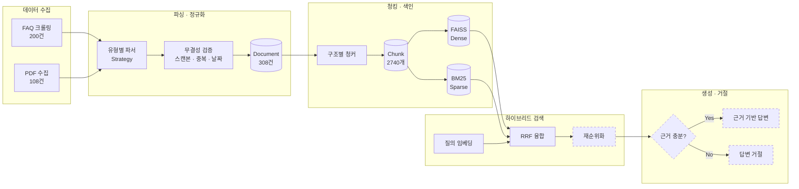

# FinGuide-RAG

> 은행 영업점·고객센터 직원이 **상품설명서·약관·FAQ의 원문 근거**를 바탕으로
> 고객 문의에 정확히 답변하도록 돕는 금융 특화 RAG 시스템 (B2E)


하나은행 공개 문서 **308건**을 정규화해 **2,740개 청크**로 색인하고,
Dense + Sparse 하이브리드 검색으로 **Recall@5 0.823**을 달성했습니다.
직접 구축한 **96건 평가셋**으로 모든 개선을 정량 측정했습니다.

---

## 주요 기능

| 기능 | 설명 |
|---|---|
| **하이브리드 검색** | Dense(FAISS) + Sparse(BM25·Kiwi)를 RRF로 결합. 베이스라인 대비 Recall@5 +8.3% |
| **문서 유형별 청킹** | 약관은 조항, 설명서는 섹션, FAQ는 Q&A 쌍 단위로 분리 (Strategy 패턴) |
| **개정 문서 버전 관리** | `content_hash`, `is_latest`, `superseded_by`로 구버전 답변 차단 |
| **데이터 무결성 자동 검증** | 스캔본·중복·크롤링 오류를 코드가 탐지 (실제로 6건 발견) |
| **정량 평가 체계** | Recall@k, MRR, NDCG@10을 난이도별·문서유형별로 측정 |
| **근거 부족 시 거절** | 검색 신뢰도가 낮으면 답변 생성 대신 거절 *(구현 예정)* |

---

## 1. 문제 정의

은행 영업점 직원은 수백 종의 상품설명서와 약관을 상대로 고객 문의에 답해야 합니다.
문서는 **시행일 단위로 개정**되며, 구버전 약관을 근거로 안내하면 불완전판매 리스크로 직결됩니다.

### 실제로 확인한 사례

수집 과정에서 마이데이터 서비스 설명서의 두 버전을 확보했습니다.

| 항목 | 2022년판 | 2026년판 |
|---|---|---|
| 심의필 | 제2022-상품-170호 | 제2026-설명서-078호 |
| 이용 연령 | 만 19세 미만 제한 | 만 14세 미만 / 14~19세 / 19세 이상 **3단계** |
| 수수료 변경 통지 | 모바일 앱 확인 | **이메일·문자 개별 통지** |

17세 고객이 마이데이터에 가입할 수 있는지 물었을 때, 구버전을 근거로 답하면
"불가"라고 잘못 안내하게 됩니다. 실제로는 비대면 신청이 가능합니다.

**이 프로젝트가 해결하려는 것**

- 직원이 자연어로 질문 → 최신 버전 문서의 해당 조항을 근거와 함께 제시
- 근거가 불충분하면 답변을 생성하지 않고 거절

---

## 2. 왜 B2C가 아니라 B2E인가

| 구분 | B2C: 고객 대상 챗봇 | **B2E: 직원 대상 보조** |
|---|---|---|
| 오답 리스크 | 불완전판매로 법적 책임 발생 | 직원이 1차 검증 |
| 요구 정확도 | 사실상 100% | 근거 제시로 보완 가능 |
| 실무 도입 가능성 | 낮음 | 높음 |
| 설계 방향 | 답변 자동화 | 의사결정 보조 |

환각 리스크를 **사람이 흡수하는 구조**로 설계했습니다.

> **한계 고지**: 실제 은행에는 내부 상품 조회 시스템이 존재합니다. 다만 대부분
> 키워드·메뉴 기반이라 "이 조건에 해당하나요" 같은 자연어 질의에 약합니다.
> 본 프로젝트는 **공개 문서로 만든 프로토타입**이며, 실제 도입 시에는 코퍼스를
> 행내 문서로 교체하는 구조로 설계했습니다.

---

## 3. 시스템 아키텍처



> 점선은 구현 예정 단계입니다.

---

## 4. 데이터

### 4.1 구성

| 유형 | 수집 | 인덱싱 대상 | 형식 | 청킹 단위 |
|---|---:|---:|---|---|
| FAQ | 200 | 200 | JSONL, 13개 카테고리 | Q&A 쌍 |
| 상품설명서 | 80 | 76 | PDF | 섹션 + 표 보존 |
| 약관 | 28 | 28 | PDF | 조항 (제N조) |
| **합계** | **308** | **304** | | **2,740 청크** |

상품설명서 4건은 텍스트 레이어가 없는 스캔본이라 제외했습니다.
제외 사유는 대장에 기록되어 있습니다.

> `document_registry.csv`의 행 수(308)는 **수집 단위** 기준입니다.
> FAQ 200건은 개별 Q&A 각각이 한 행이고, PDF는 파일 하나가 한 행입니다.

### 4.2 문서 구조 분포

파싱 단계에서 실제 본문을 분석해 구조를 분류했습니다.

| 구조 | 건수 | 청킹 전략 |
|---|---:|---|
| `article` | 36 | 제N조 단위 |
| `flat` | 34 | 길이 기반 재귀 분할 |
| `clause` | 18 | ①②③ 항 단위 |
| `numbered` | 16 | 번호 목록 단위 |
| `qa_pair` | 200 | Q&A 쌍 |

> **설계 근거**: 문서 유형(설명서/약관)과 내부 구조는 일치하지 않습니다.
> 설명서에도 조항 구조가 15건, 약관에도 구조 표지가 없는 서식이 4건 있었습니다.
> 따라서 청킹은 유형이 아니라 **실측된 구조**로 라우팅합니다.

### 4.3 데이터 무결성 검증

수집 데이터를 그대로 신뢰하지 않고 자동 검증을 거쳤습니다.

| 문제 | 건수 | 탐지 방법 |
|---|---:|---|
| 스캔본 (텍스트 레이어 없음) | 4 | 페이지당 문자 수 임계값 |
| 크롤링 오류 (파일명↔내용 불일치) | 2 | 본문 SHA-256 해시 중복 탐지 |
| 제목 오추출 | 5 | 규칙 기반 감사 + 수동 매핑 |

크롤링 오류 사례: NDF 설명서 파일에 FX SWAP 설명서가 저장되어 있었습니다.
두 파일의 본문 해시가 동일했고 심의필 번호도 같았습니다. 원본을 재수집해 교체했습니다.

### 4.4 데이터 재현 방법

원본 PDF는 저작권상 저장소에 포함하지 않습니다. 대신
`data/registry/document_registry.csv`에 수집 정보를 기록합니다.

| 컬럼 | 설명 |
|---|---|
| `doc_id` | 문서 고유 ID |
| `doc_type` | 설명서 / 약관 / FAQ |
| `title`, `subtitle` | PDF에서 추출한 한글 제목 |
| `effective_date` | 시행일 (파일명 기준) |
| `compliance_no` | 준법감시인 심의필 번호 |
| `content_hash` | 본문 SHA-256 (변경 감지) |
| `is_latest`, `superseded_by` | 버전 관계 |
| `is_parsable`, `exclusion_reason` | 인덱싱 제외 여부와 사유 |
| `orig_filename` | 원본 파일명 |

대장을 참고해 하나은행 공개 페이지에서 동일 문서를 내려받아
`data/raw/hana/{desc,terms}/`에 배치하면 파이프라인을 재현할 수 있습니다.

---

## 5. 핵심 설계 결정

| 결정 | 선택 | 근거 |
|---|---|---|
| 임베딩 모델 | multilingual-e5-small (실험) / BGE-M3 (최종) | 실측 47ms vs 546ms(11.6배). 반복 실험은 경량, 최종 인덱스는 대형 |
| 청크 크기 | 목표 500자 / 최대 900자 | 실측 문자당 토큰비 **0.62** → 512토큰 초과 0건 |
| 벡터 인덱스 | FAISS `IndexFlatIP` (정확 검색) | 2,740 벡터 규모에서 근사 검색은 불필요. 확장 시 IVF/HNSW 교체 가능 |
| 검색 방식 | Dense + Sparse 하이브리드 (RRF) | 실패 23건 중 20건이 정답 청크에 질의 어휘 25% 이상 포함 |
| 한국어 토크나이저 | Kiwi | Java 의존성 없음 → Windows 재현 용이 (KoNLPy는 JVM 필요) |
| 청킹 전략 | 구조별 분기 (Strategy 패턴) | 문서 유형과 내부 구조가 불일치 (4.2 참조) |
| 버전 관리 | `content_hash`, `is_latest`, `superseded_by` | 개정 문서로 인한 오답 방지 (1절 사례) |

---

## 6. 평가

### 6.1 평가셋 구축

정량 평가의 신뢰도는 평가셋 품질에 달려 있으므로 생성 과정을 문서화했습니다.

| 단계 | 방법 |
|---|---|
| 표본 추출 | 문서 유형별 비중 고정 (설명서 50% / 약관 30% / FAQ 20%) |
| 정형 문구 제외 | 3개 이상 문서에 반복되는 청크를 자동 탐지해 제외 |
| 질문 생성 | `gpt-4.1-mini`로 난이도 3단계 생성 |
| 자동 검증 | 어절 겹침률, hard 난이도 용어 회피 준수 검사 |
| 정답 확장 | 상위 후보를 LLM으로 판정 (근거가 20위 밖이면 판정 생략) |
| 사람 검수 | 자동 검사에 걸린 항목을 직접 확인 |

**생성 110건 → 검수 후 96건 확정** (제외 14건)

| 난이도 | 건수 | 정의 |
|---|---:|---|
| easy | 31 | 상품명 + 문서의 정식 용어 사용 |
| medium | 46 | 상품명은 언급하되 구어체 |
| hard | 19 | 상품명·전문용어 배제, 상황만 서술 |

제외 사유: 대상 불명확 7건, 질문–근거 불일치 4건, 표현 베낌 2건, 기타 1건

> **정답 확장 시 발견한 문제**: 초기 실험에서 "청약저축 월 납입 미이행" 질문에
> "대출 연체이자" 청크가 정답으로 판정된 오판이 있었습니다. 판정 LLM에
> **출처 문서명을 함께 제공**하고, 근거 청크가 20위 밖이면 판정을 생략하도록
> 수정했습니다. 검색 실패를 대체 문서로 성공 처리하면 지표가 왜곡됩니다.

### 6.2 검색 성능

평가셋 96건 기준, 임베딩은 `multilingual-e5-small`입니다.

| 지표 | 베이스라인 (Dense 단독) | **하이브리드 (RRF α=0.7)** | 개선 |
|---|---:|---:|---:|
| Recall@1 | 0.552 | **0.615** | +11.4% |
| Recall@5 | 0.760 | **0.823** | **+8.3%** |
| MRR | 0.648 | **0.707** | +9.1% |

**문서 유형별** — 개선이 가장 필요했던 약관에서 효과가 가장 컸습니다.

| 문서 유형 | Dense 단독 | 하이브리드 | 개선 |
|---|---:|---:|---:|
| FAQ | 0.955 | **1.000** | +4.7% |
| 상품설명서 | 0.765 | **0.824** | +7.7% |
| 약관 | 0.565 | **0.652** | **+15.4%** |

> 약관이 가장 낮은 이유는 문체 격차입니다. 질의는 "돈 빌린 사람이 약속을
> 안 지켜서…"인데 문서는 "제8조 ① 기한이익이 상실될 때…"입니다.
> 어휘 기반 검색(BM25)이 이 격차를 부분적으로 메웁니다.

### 6.3 실험 기록

**하이브리드 결합 방식 탐색** (Recall@5)

| α (dense 가중치) | 0.3 | 0.5 | 0.7 | 0.8 | 0.9 |
|---|---:|---:|---:|---:|---:|
| 가중합 (min-max) | 0.760 | 0.812 | 0.812 | 0.802 | 0.792 |
| 가중합 (z-score) | 0.771 | 0.812 | 0.812 | – | – |
| RRF | 0.750 | 0.781 | **0.823** | 0.812 | 0.771 |

Sparse 단독은 0.677로 Dense 단독(0.760)보다 낮았습니다.
**BM25는 주력이 아니라 후보 보강 역할**이며, 순위 결정은 Dense가 맡는 편이 낫습니다.
α=0.7에서 정점을 지나며 그 이상은 오히려 하락합니다.

**실패 원인별 분포 변화**

| 정답 문서 순위 | Dense 단독 | 하이브리드 | 처방 |
|---|---:|---:|---|
| 1~5위 (성공) | 73 | **79** | – |
| 6~20위 | 7 | 8 | 재순위화 |
| 20위 밖 | 16 | **9** | 후보 확보 |

BM25 도입으로 **20위 밖이 16건 → 9건**으로 줄었습니다. 후보 확보 목적을 달성했습니다.

### 6.4 문제 해결 기록

**① 하이브리드 정규화 오류**

초기 가중합 구현이 Dense 단독보다 **나쁜** 결과를 냈습니다(0.760 → 0.729).

원인은 min-max 정규화였습니다. 한쪽 후보에만 있는 문서에 0점을 부여했는데,
Dense 점수는 코사인 유사도라 0.86~0.92의 좁은 구간에 몰려 있습니다.
여기에 0이 섞이면 min이 0이 되어 실질 차이가 압축됩니다.

```
수정 전: Dense 후보의 정규화 후 범위 0.9891 ~ 1.0000 (폭 0.0109)
수정 후: Dense 후보의 정규화 후 범위 0.0000 ~ 1.0000 (폭 1.0000)
```

Dense의 순위 정보가 1% 폭으로 뭉개지면서 BM25(0~1 전 구간)가 결합을 지배했습니다.
**후보에 있는 문서만으로 정규화 기준을 계산**하도록 수정하니 0.729 → 0.812로 개선됐습니다.

**② 불용어 가설 기각**

표본 400개 통계에서 `상품`, `설명서`가 100% 문서에 등장해 불용어 후보로 의심했습니다.
그러나 전수 조사 결과 각각 70.4%, 65.6%였고 **문서 유형 간 분포 편차가 컸습니다**
(설명서 98% vs 약관 거의 0%). 오히려 문서 유형을 가르는 유용한 신호였습니다.

표본 통계로 성급히 최적화하지 않고 전수 검증한 사례입니다.

---

## 7. 모델 및 환경

| 구성 요소 | 사용 모델·라이브러리 | 비고 |
|---|---|---|
| Dense 임베딩 | `intfloat/multilingual-e5-small` (384차원) | 실험용. `passage:`/`query:` 접두어 적용 |
| Dense 임베딩 (최종 예정) | `BAAI/bge-m3` (1024차원, 8192토큰) | 최종 인덱스용 |
| Sparse 검색 | BM25Okapi + Kiwi 형태소 분석 | k1=1.2, b=0.75 |
| 벡터 인덱스 | FAISS `IndexFlatIP` | L2 정규화 → 내적 = 코사인 유사도 |
| 결합 방식 | RRF (α=0.7, k=60) | 가중합·z-score와 비교 실험 후 채택 |
| 평가셋 생성 | OpenAI `gpt-4.1-mini` | 생성 후 사람 검수 |
| Reranker | 미정 | Cross-encoder 검토 예정 |
| Generator | 미정 | 근거 기반 생성 및 거절 판단 |

### 환경 변수

프로젝트 루트에 `.env`를 만들고 다음을 설정합니다. `.env.example`을 복사해 사용하세요.

```
OPENAI_API_KEY=sk-...
EVAL_GENERATION_MODEL=gpt-4.1-mini
```

`.env`는 `.gitignore`에 포함되어 저장소에 올라가지 않습니다.

---

## 8. 실행 방법

```powershell
# 1) 가상환경
py -3.14 -m venv .venv
.venv\Scripts\activate
pip install -r requirements.lock.txt

# 2) 원본 문서 배치 (저작권상 저장소 미포함, 4.4 참조)
#    data/raw/hana/desc/   상품설명서 PDF
#    data/raw/hana/terms/  약관 PDF
#    data/raw/hana/faq/    faq_hana.jsonl

# 3) 파이프라인 실행
python scripts/06_build_documents.py    # 파싱 및 대장 구축
python scripts/09_build_chunks.py       # 청킹
python scripts/11_build_index.py        # Dense 인덱스 (FAISS)
python scripts/19_build_bm25.py         # Sparse 인덱스 (BM25)

# 4) 검색 확인
python scripts/12_search.py --demo

# 5) 성능 평가
python scripts/17_evaluate.py --tag baseline
python scripts/20_tune_hybrid.py
```

> **Python 버전**: 개발·검증은 Python 3.14.6에서 수행했습니다.
> `faiss-cpu 1.14.3`, `torch 2.13.0`, `numpy 2.5.1` 모두 cp314 휠이 제공되어
> 소스 빌드 없이 설치됩니다. 정확한 재현은 `requirements.lock.txt`를 사용하세요.

---

## 9. 프로젝트 구조

```
finguide-rag/
├─ src/finguide_rag/
│  ├─ schema.py            # Document / Chunk 공통 스키마
│  ├─ parsing/             # PDF·JSONL → Document (Strategy + Factory)
│  ├─ chunking/            # 구조별 청킹 전략
│  ├─ embedding/           # 임베딩 래퍼 + FAISS 스토어
│  ├─ retrieval/           # BM25 + 하이브리드 결합
│  └─ evaluation/          # Recall@k, MRR, NDCG
├─ scripts/                # 번호순 파이프라인 (01~21)
├─ data/
│  ├─ raw/                 # 원본 (git 제외)
│  ├─ registry/            # 문서 대장, 제목 보정 (git 포함)
│  ├─ interim/             # 파싱·청킹 산출물 (git 제외)
│  ├─ eval/                # 평가셋 (git 포함)
│  └─ indexes/             # FAISS·BM25 인덱스 (git 제외)
└─ reports/                # 평가 리포트 및 실험 기록
```

**스크립트 흐름**

| 번호 | 스크립트 | 역할 |
|---|---|---|
| 01–03 | 수집·검증·대장 | FAQ 크롤링, 무결성 검증, 문서 대장 |
| 04–05 | 관찰·전수조사 | PDF 구조 분석, 스캔본·제목 진단 |
| 06 | `build_documents` | 파싱 및 공통 스키마 정규화 |
| 09–10 | `build_chunks`, `inspect_chunks` | 청킹 및 토큰 수 검증 |
| 11–12 | `build_index`, `search` | Dense 인덱스, 검색 CLI |
| 13 | `audit_titles` | 제목 추출 감사 |
| 14–16 | 평가셋 생성·검수·확정 | LLM 생성 → 사람 검수 → 확정 |
| 17–18 | `evaluate`, `analyze_failures` | 성능 측정, 실패 분석 |
| 19–21 | BM25·하이브리드·어휘 분석 | Sparse 검색 및 결합 실험 |

---

## 10. 진행 현황

**완료**

- [x] 저장소 구조화 및 개발 환경 구성 (Python 3.14)
- [x] FAQ 200건 수집 및 형식 무결성 검증
- [x] 상품설명서 80건 / 약관 28건 확보
- [x] PDF 전수조사 (스캔본 4건, 크롤링 오류 2건 탐지·교체)
- [x] 파싱 및 공통 스키마 정규화 (304건 인덱싱 대상 확정)
- [x] 문서 대장 구축 (`document_registry.csv`)
- [x] 구조별 청킹 (2,740 청크, 토큰 한계 검증 완료)
- [x] Dense 인덱스 구축 (FAISS, e5-small)
- [x] 검색 평가셋 구축 (96건, LLM 생성 + 사람 검수)
- [x] 평가 모듈 구현 (Recall@k, MRR, NDCG@10)
- [x] 베이스라인 측정 (Recall@5 0.760)
- [x] BM25 Sparse 검색 구현 (Kiwi 형태소 기반)
- [x] 하이브리드 결합 및 파라미터 실험 (**Recall@5 0.823**)

**진행 예정**

- [ ] FAQ 공식 원문 대조 검수
- [ ] 구조별 청킹 전략 세분화 및 효과 측정
- [ ] Cross-encoder 재순위화
- [ ] BGE-M3 최종 인덱스 및 모델 비교
- [ ] 거절 평가셋 구축 (근거 없는 질문 30~50건)
- [ ] 거절 로직 구현 및 측정 (Refusal Accuracy, False Answer Rate)
- [ ] 근거 기반 답변 생성
- [ ] Streamlit 데모
- [ ] 문서 개정 자동 감지 파이프라인

---

## 11. 거절(Refusal) 설계 방향

*아직 구현 전이며, 베이스라인 측정에서 확보한 근거로 설계 중입니다.*

절대 유사도 임계값만으로는 판정이 어렵다는 것을 측정으로 확인했습니다.

| 구분 | 건수 | top-1 점수 평균 | 1위–2위 격차 평균 |
|---|---:|---:|---:|
| 검색 성공 (5위 내) | 73 | 0.9053 | **0.0120** |
| 검색 실패 (미발견) | 16 | 0.8976 | **0.0017** |

top-1 점수 차이는 0.0077로 미미하지만 **1위–2위 격차는 7배** 차이입니다.
따라서 절대 점수가 아니라 상대적 신호를 사용할 계획입니다.

검토 중인 거절 신호:

- 1위–2위 점수 격차가 임계값 미만
- 질의의 상품명과 검색 문서의 상품명 불일치
- 재순위화 점수가 낮음
- 문서에 항목은 있으나 값이 공란인 경우

마지막 항목은 실제 사례가 있습니다. 여신거래추가약정서의 한도약정수수료는
`여신한도 약정금액 × ( )% × 약정기간 ÷ 365일`로 **요율이 빈칸**입니다.
검색은 성공하지만 답을 생성하면 안 되는 경우입니다.

---

## 12. 한계

- 평가셋 질문이 LLM으로 생성되어 실제 직원의 질의 분포와 다를 수 있습니다.
- 정답 라벨을 LLM이 1차 판정했으므로 누락된 정답이 있을 수 있습니다.
- FAQ는 형식 무결성만 검증했으며, 공식 원문과의 대조 검수는 진행 예정입니다.
- 하나은행 공개 문서만 대상이며 행내 시스템의 실제 문서와는 다릅니다.
- 스캔본 4건(발행어음, 어음관리계좌 등)은 OCR 미적용으로 제외되어 있습니다.
- 타행 확장은 `bank_code` 필드로 구조만 마련했을 뿐 실제 검증하지 않았습니다.

---

## 13. 라이선스 및 데이터 고지

- 본 저장소의 **소스코드**는 MIT License를 따릅니다.
- 하나은행 상품설명서·약관·FAQ의 **저작권은 원 저작권자**에게 있으며,
  본 저장소에는 원문 파일을 포함하지 않습니다.
- 수집 문서의 **메타데이터와 평가셋**은 연구·학습 목적의 재현을 위해 제공합니다.
- 본 프로젝트는 하나은행과 무관한 개인 학습용 프로젝트입니다.
