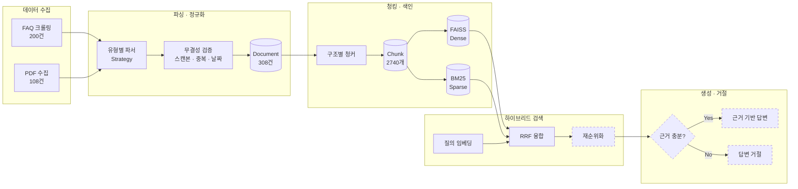

# README 스냅샷 — 2026-08-23 11:31

- 루트: `C:\Programming\MyProject\financial_rag_project`
- 파이썬: 3.14.6
- 생성 스크립트: `37_readme_snapshot.py`


## 1. 디렉터리 트리

```
financial_rag_project/
├── _backup/
│   ├── refusal.py.bak  [18.8KB]
│   ├── refusal_pre_docfix.py.bak  [19.3KB]
│   └── refusal_v2.py.bak  [24.1KB]
├── app/
├── configs/
│   └── banks/
├── data/ (파일 167개, 내용 생략)
├── docs/
├── notebooks/
├── outputs/ (파일 0개, 내용 생략)
├── reports/
│   ├── coverage_measure_2026-08-15.csv  [66.6KB]
│   ├── eval_baseline_dense_2026-08-13.json  [6.7KB]
│   ├── eval_baseline_dense_2026-08-13.md  [2.5KB]
│   ├── eval_baseline_doclevel_2026-08-14.json  [6.7KB]
│   ├── eval_baseline_doclevel_2026-08-14.md  [2.5KB]
│   ├── eval_set_summary.md  [2.0KB]
│   ├── eval_structural_2026-08-14.json  [6.7KB]
│   ├── eval_structural_2026-08-14.md  [2.5KB]
│   ├── eval_structural_v2_2026-08-14.json  [6.7KB]
│   ├── eval_structural_v2_2026-08-14.md  [2.5KB]
│   ├── failures_baseline_dense_2026-08-13.csv  [7.6KB]
│   ├── failures_baseline_doclevel_2026-08-14.csv  [2.5KB]
│   ├── failures_structural_2026-08-14.csv  [9.3KB]
│   ├── failures_structural_v2_2026-08-14.csv  [7.7KB]
│   ├── false_refusal_diag_2026-08-23.csv  [3.8KB]
│   ├── g_eval_full_2026-08-23.csv  [19.7KB]
│   ├── g_eval_labels_2026-08-21.csv  [7.3KB]
│   ├── g_eval_v2_2026-08-23.csv  [9.2KB]
│   ├── g_eval_v2_sentences_2026-08-23.csv  [8.2KB]
│   ├── hybrid_tuning_2026-08-13.json  [18.9KB]
│   ├── hybrid_tuning_2026-08-13.md  [3.3KB]
│   ├── hybrid_tuning_baseline_doclevel_2026-08-14.json  [25.9KB]
│   ├── hybrid_tuning_baseline_doclevel_2026-08-14.md  [3.9KB]
│   ├── hybrid_tuning_final_doclevel_2026-08-14.json  [25.9KB]
│   ├── hybrid_tuning_final_doclevel_2026-08-14.md  [3.9KB]
│   ├── hybrid_tuning_structural_2026-08-14.json  [26.0KB]
│   ├── hybrid_tuning_structural_2026-08-14.md  [3.9KB]
│   ├── hybrid_tuning_structural_doclevel_2026-08-14.json  [25.9KB]
│   ├── hybrid_tuning_structural_doclevel_2026-08-14.md  [3.9KB]
│   ├── hybrid_tuning_structural_v2_2026-08-14.json  [26.0KB]
│   ├── hybrid_tuning_structural_v2_2026-08-14.md  [3.9KB]
│   ├── judge_calibration_2026-08-21.csv  [307B]
│   ├── mismatch_review_2026-08-23.csv  [8.1KB]
│   ├── refusal_eval_2026-08-14.csv  [7.8KB]
│   ├── refusal_eval_2026-08-14.json  [1.7KB]
│   ├── refusal_eval_2026-08-15.csv  [7.8KB]
│   ├── refusal_eval_2026-08-15.json  [1.6KB]
│   ├── refusal_eval_2026-08-23.csv  [7.8KB]
│   ├── refusal_eval_2026-08-23.json  [1.6KB]
│   ├── refusal_signals_2026-08-14.csv  [11.5KB]
│   └── … (항목 수 제한으로 일부 생략)
├── scripts/
│   ├── 01_crawl_hana_faq.py  [6.4KB]
│   ├── 02_validate_faq.py  [7.2KB]
│   ├── 03_build_registry.py  [5.9KB]
│   ├── 04_inspect_pdfs.py  [7.6KB]
│   ├── 05_triage_pdfs.py  [12.2KB]
│   ├── 06_build_documents.py  [15.1KB]
│   ├── 07_inspect_issues.py  [3.6KB]
│   ├── 08_benchmark_embedding.py  [6.4KB]
│   ├── 09_build_chunks.py  [12.2KB]
│   ├── 10_inspect_chunks.py  [4.2KB]
│   ├── 11_build_index.py  [7.1KB]
│   ├── 12_search.py  [4.6KB]
│   ├── 13_audit_titles.py  [8.7KB]
│   ├── 14_generate_eval.py  [32.7KB]
│   ├── 15_review_eval.py  [10.1KB]
│   ├── 16_finalize_eval.py  [16.6KB]
│   ├── 17_evaluate.py  [15.8KB]
│   ├── 18_analyze_failures.py  [8.0KB]
│   ├── 19_build_bm25.py  [6.7KB]
│   ├── 20_tune_hybrid.py  [16.4KB]
│   ├── 21_analyze_vocab.py  [7.8KB]
│   ├── 22_remap_eval.py  [12.1KB]
│   ├── 23_list_indexes.py  [4.9KB]
│   ├── 24_generate_refusal_set.py  [16.4KB]
│   ├── 25_review_refusal.py  [9.4KB]
│   ├── 26_analyze_refusal_signals.py  [15.1KB]
│   ├── 27_evaluate_refusal.py  [22.0KB]
│   ├── 28_tune_refusal_v2.py  [26.0KB]
│   ├── 29_diagnose_spacing.py  [9.1KB]
│   ├── 30_answer_cli.py  [4.4KB]
│   ├── 31_measure_coverage.py  [10.0KB]
│   ├── 32_build_g_evalset.py  [18.0KB]
│   ├── 33_calibrate_judge.py  [12.0KB]
│   ├── 34_evaluate_g_v2.py  [27.2KB]
│   ├── 35_apply_review.py  [8.7KB]
│   ├── 36_evaluate_g_full.py  [18.1KB]
│   ├── 37_readme_snapshot.py  [13.9KB]
│   ├── 37_review_mismatch.py  [10.6KB]
│   ├── 38_diagnose_refusal.py  [10.0KB]
│   ├── 39_check_patterns.py  [10.9KB]
│   └── … (항목 수 제한으로 일부 생략)
├── src/
│   └── finguide_rag/
│       ├── chunking/
│       │   ├── strategies/
│       │   │   └── … (깊이 제한)
│       │   ├── __init__.py  [493B]
│       │   ├── base.py  [5.9KB]
│       │   ├── factory.py  [2.4KB]
│       │   ├── flat_chunker.py  [3.9KB]
│       │   └── structural_chunker.py  [10.9KB]
│       ├── embedding/
│       │   ├── __init__.py  [270B]
│       │   ├── embedder.py  [4.9KB]
│       │   └── store.py  [7.0KB]
│       ├── evaluation/
│       │   ├── __init__.py  [462B]
│       │   └── metrics.py  [6.9KB]
│       ├── generation/
│       │   ├── prompt_templates/
│       │   │   └── … (깊이 제한)
│       │   ├── __init__.py  [633B]
│       │   ├── catalog_matcher.py  [6.4KB]
│       │   ├── generator.py  [14.5KB]
│       │   ├── pipeline.py  [5.7KB]
│       │   ├── product_catalog.py  [11.4KB]
│       │   ├── product_match.py  [7.7KB]
│       │   ├── query_analyzer.py  [7.8KB]
│       │   └── refusal.py  [29.4KB]
│       ├── ingestion/
│       │   ├── crawlers/
│       │   │   └── … (깊이 제한)
│       │   └── parsers/
│       │       └── … (깊이 제한)
│       ├── parsing/
│       │   ├── __init__.py  [361B]
│       │   ├── base.py  [1.6KB]
│       │   ├── factory.py  [1.6KB]
│       │   ├── faq_parser.py  [3.8KB]
│       │   └── pdf_parser.py  [14.1KB]
│       ├── retrieval/
│       │   ├── __init__.py  [472B]
│       │   ├── hybrid_retriever.py  [11.3KB]
│       │   └── sparse_retriever.py  [8.6KB]
│       ├── schemas/
│       ├── __init__.py  [0B]
│       └── schema.py  [10.0KB]
├── tests/
├── .env  [179B]
├── .gitattributes  [467B]
├── .gitignore  [2.1KB]
├── README.md  [23.3KB]
├── requirements.lock.txt  [2.4KB]
├── requirements.txt  [1.4KB]
└── setup_repo.ps1  [4.2KB]
```

## 2. 현재 README.md 전문

- 크기: 23.3KB / 수정일: 2026-08-14 19:53

````markdown
# FinGuide-RAG

> 은행 영업점·고객센터 직원이 **상품설명서·약관·FAQ의 원문 근거**를 바탕으로
> 고객 문의에 정확히 답변하도록 돕는 금융 특화 RAG 시스템 (B2E)


하나은행 공개 문서 **308건**을 정규화해 **2,999개 청크**로 색인하고,
Dense + Sparse 하이브리드 검색으로 **문서 단위 Recall@5 0.979**를 달성했습니다.
직접 구축한 **96건 평가셋**으로 모든 개선을 정량 측정했으며,
청킹 전략·결합 방식·가중치를 실험으로 결정했습니다.

---

## 주요 기능

| 기능 | 설명 |
|---|---|
| **하이브리드 검색** | Dense(FAISS) + Sparse(BM25·Kiwi) 결합. 약관 Recall@5 0.739 → 0.957 |
| **구조별 청킹** | 약관은 제N조, 항 구조는 ①②③, 목록형은 번호, FAQ는 Q&A 쌍 (Strategy 패턴) |
| **개정 문서 버전 관리** | `content_hash`, `is_latest`, `superseded_by`로 구버전 답변 차단 |
| **데이터 무결성 자동 검증** | 스캔본·중복·크롤링 오류를 코드가 탐지 (실제로 6건 발견) |
| **정량 평가 체계** | Recall@k, MRR, NDCG@10을 난이도별·문서유형별로 측정 |
| **근거 부족 시 거절** | 검색 신뢰도가 낮으면 답변 생성 대신 거절 *(구현 예정)* |

---

## 1. 문제 정의

은행 영업점 직원은 수백 종의 상품설명서와 약관을 상대로 고객 문의에 답해야 합니다.
문서는 **시행일 단위로 개정**되며, 구버전 약관을 근거로 안내하면 불완전판매 리스크로 직결됩니다.

### 실제로 확인한 사례

수집 과정에서 마이데이터 서비스 설명서의 두 버전을 확보했습니다.

| 항목 | 2022년판 | 2026년판 |
|---|---|---|
| 심의필 | 제2022-상품-170호 | 제2026-설명서-078호 |
| 이용 연령 | 만 19세 미만 제한 | 만 14세 미만 / 14~19세 / 19세 이상 **3단계** |
| 수수료 변경 통지 | 모바일 앱 확인 | **이메일·문자 개별 통지** |

17세 고객이 마이데이터에 가입할 수 있는지 물었을 때, 구버전을 근거로 답하면
"불가"라고 잘못 안내하게 됩니다. 실제로는 비대면 신청이 가능합니다.

**이 프로젝트가 해결하려는 것**

- 직원이 자연어로 질문 → 최신 버전 문서의 해당 조항을 근거와 함께 제시
- 근거가 불충분하면 답변을 생성하지 않고 거절

---

## 2. 왜 B2C가 아니라 B2E인가

| 구분 | B2C: 고객 대상 챗봇 | **B2E: 직원 대상 보조** |
|---|---|---|
| 오답 리스크 | 불완전판매로 법적 책임 발생 | 직원이 1차 검증 |
| 요구 정확도 | 사실상 100% | 근거 제시로 보완 가능 |
| 실무 도입 가능성 | 낮음 | 높음 |
| 설계 방향 | 답변 자동화 | 의사결정 보조 |

환각 리스크를 **사람이 흡수하는 구조**로 설계했습니다.

> **한계 고지**: 실제 은행에는 내부 상품 조회 시스템이 존재합니다. 다만 대부분
> 키워드·메뉴 기반이라 "이 조건에 해당하나요" 같은 자연어 질의에 약합니다.
> 본 프로젝트는 **공개 문서로 만든 프로토타입**이며, 실제 도입 시에는 코퍼스를
> 행내 문서로 교체하는 구조로 설계했습니다.

---

## 3. 시스템 아키텍처



> 점선은 구현 예정 단계입니다.

---

## 4. 데이터

### 4.1 구성

| 유형 | 수집 | 인덱싱 대상 | 형식 | 청킹 단위 |
|---|---:|---:|---|---|
| FAQ | 200 | 200 | JSONL, 13개 카테고리 | Q&A 쌍 |
| 상품설명서 | 80 | 76 | PDF | 섹션 + 표 보존 |
| 약관 | 28 | 28 | PDF | 조항 (제N조) |
| **합계** | **308** | **304** | | **2,999 청크** |

상품설명서 4건은 텍스트 레이어가 없는 스캔본이라 제외했습니다.
제외 사유는 대장에 기록되어 있습니다.

> `document_registry.csv`의 행 수(308)는 **수집 단위** 기준입니다.
> FAQ 200건은 개별 Q&A 각각이 한 행이고, PDF는 파일 하나가 한 행입니다.

### 4.2 문서 구조 분포

파싱 단계에서 실제 본문을 분석해 구조를 분류했습니다.

| 구조 | 건수 | 청킹 전략 |
|---|---:|---|
| `article` | 36 | 제N조 단위 |
| `flat` | 34 | 길이 기반 재귀 분할 |
| `clause` | 18 | ①②③ 항 단위 |
| `numbered` | 16 | 번호 목록 단위 |
| `qa_pair` | 200 | Q&A 쌍 |

> **설계 근거**: 문서 유형(설명서/약관)과 내부 구조는 일치하지 않습니다.
> 설명서에도 조항 구조가 15건, 약관에도 구조 표지가 없는 서식이 4건 있었습니다.
> 따라서 청킹은 유형이 아니라 **실측된 구조**로 라우팅합니다.
> 이 전략은 길이 기반 청킹과 비교 실험해 채택했습니다(6.3 참조).

### 4.3 데이터 무결성 검증

수집 데이터를 그대로 신뢰하지 않고 자동 검증을 거쳤습니다.

| 문제 | 건수 | 탐지 방법 |
|---|---:|---|
| 스캔본 (텍스트 레이어 없음) | 4 | 페이지당 문자 수 임계값 |
| 크롤링 오류 (파일명↔내용 불일치) | 2 | 본문 SHA-256 해시 중복 탐지 |
| 제목 오추출 | 5 | 규칙 기반 감사 + 수동 매핑 |

크롤링 오류 사례: NDF 설명서 파일에 FX SWAP 설명서가 저장되어 있었습니다.
두 파일의 본문 해시가 동일했고 심의필 번호도 같았습니다. 원본을 재수집해 교체했습니다.

### 4.4 데이터 재현 방법

원본 PDF는 저작권상 저장소에 포함하지 않습니다. 대신
`data/registry/document_registry.csv`에 수집 정보를 기록합니다.

| 컬럼 | 설명 |
|---|---|
| `doc_id` | 문서 고유 ID |
| `doc_type` | 설명서 / 약관 / FAQ |
| `title`, `subtitle` | PDF에서 추출한 한글 제목 |
| `effective_date` | 시행일 (파일명 기준) |
| `compliance_no` | 준법감시인 심의필 번호 |
| `content_hash` | 본문 SHA-256 (변경 감지) |
| `is_latest`, `superseded_by` | 버전 관계 |
| `is_parsable`, `exclusion_reason` | 인덱싱 제외 여부와 사유 |
| `orig_filename` | 원본 파일명 |

대장을 참고해 하나은행 공개 페이지에서 동일 문서를 내려받아
`data/raw/hana/{desc,terms}/`에 배치하면 파이프라인을 재현할 수 있습니다.

---

## 5. 핵심 설계 결정

| 결정 | 선택 | 근거 |
|---|---|---|
| 임베딩 모델 | multilingual-e5-small (실험) / BGE-M3 (최종) | 실측 47ms vs 546ms(11.6배). 반복 실험은 경량, 최종 인덱스는 대형 |
| 청크 크기 | 목표 500자 / 최대 900자 | 실측 문자당 토큰비 **0.62** → 512토큰 초과 0건 |
| 벡터 인덱스 | FAISS `IndexFlatIP` (정확 검색) | 2,740 벡터 규모에서 근사 검색은 불필요. 확장 시 IVF/HNSW 교체 가능 |
| 검색 방식 | Dense + Sparse 하이브리드 (가중합 α=0.5) | 실패 23건 중 20건이 정답 청크에 질의 어휘 25% 이상 포함 |
| 한국어 토크나이저 | Kiwi | Java 의존성 없음 → Windows 재현 용이 (KoNLPy는 JVM 필요) |
| 청킹 전략 | 구조별 분기 (Strategy 패턴) | 실험 결과 문서 단위 Recall@5 0.958 → 0.979 (6.3 참조) |
| 점수 정규화 | 후보 집합 한정 min-max | 전체 정규화 시 Dense 점수 분포가 압축돼 결합이 왜곡됨 (6.4 참조) |
| 버전 관리 | `content_hash`, `is_latest`, `superseded_by` | 개정 문서로 인한 오답 방지 (1절 사례) |

---

## 6. 평가

### 6.1 평가셋 구축

정량 평가의 신뢰도는 평가셋 품질에 달려 있으므로 생성 과정을 문서화했습니다.

| 단계 | 방법 |
|---|---|
| 표본 추출 | 문서 유형별 비중 고정 (설명서 50% / 약관 30% / FAQ 20%) |
| 정형 문구 제외 | 3개 이상 문서에 반복되는 청크를 자동 탐지해 제외 |
| 질문 생성 | `gpt-4.1-mini`로 난이도 3단계 생성 |
| 자동 검증 | 어절 겹침률, hard 난이도 용어 회피 준수 검사 |
| 정답 확장 | 상위 후보를 LLM으로 판정 (근거가 20위 밖이면 판정 생략) |
| 사람 검수 | 자동 검사에 걸린 항목을 직접 확인 |

**생성 110건 → 검수 후 96건 확정** (제외 14건)

| 난이도 | 건수 | 정의 |
|---|---:|---|
| easy | 31 | 상품명 + 문서의 정식 용어 사용 |
| medium | 46 | 상품명은 언급하되 구어체 |
| hard | 19 | 상품명·전문용어 배제, 상황만 서술 |

제외 사유: 대상 불명확 7건, 질문–근거 불일치 4건, 표현 베낌 2건, 기타 1건

> **정답 확장 시 발견한 문제**: 초기 실험에서 "청약저축 월 납입 미이행" 질문에
> "대출 연체이자" 청크가 정답으로 판정된 오판이 있었습니다. 판정 LLM에
> **출처 문서명을 함께 제공**하고, 근거 청크가 20위 밖이면 판정을 생략하도록
> 수정했습니다. 검색 실패를 대체 문서로 성공 처리하면 지표가 왜곡됩니다.

### 6.2 검색 성능

평가 단위를 두 가지로 나눠 측정합니다.

- **청크 단위**: 정확한 조항을 짚었는지. 실사용 품질에 직결됩니다.
- **문서 단위**: 올바른 문서를 찾았는지. **청킹 전략 비교에 씁니다.**

청킹 방식을 바꾸면 청크 ID가 달라져 평가셋 라벨을 재매핑해야 하는데,
그 과정에서 라벨 수가 변하면 지표가 왜곡됩니다. 실제로 재매핑 방식에 따라
같은 인덱스의 Recall@5가 0.708에서 0.781까지 움직였습니다. 문서 ID는 청킹과
무관하게 불변이므로, 전략 비교는 문서 단위로 해야 공정합니다.

**최종 성능** (구조별 청킹 + weighted α=0.5, 문서 단위)

| 지표 | Dense 단독 | **하이브리드** | 개선 |
|---|---:|---:|---:|
| Recall@1 | 0.688 | **0.729** | +6.0% |
| Recall@5 | 0.896 | **0.979** | **+9.3%** |
| MRR | 0.783 | **0.828** | +5.7% |

96건 중 94건에서 정답 문서를 상위 5개 안에 찾았습니다.

**문서 유형별** (하이브리드)

| 문서 유형 | Dense 단독 | 하이브리드 | 개선 |
|---|---:|---:|---:|
| FAQ | 0.955 | **1.000** | +4.7% |
| 상품설명서 | 0.941 | **0.980** | +4.1% |
| 약관 | 0.739 | **0.957** | **+29.5%** |

약관에서 개선폭이 압도적입니다. 이유는 6.3에서 설명합니다.

### 6.3 실험 기록

#### 실험 1 — 하이브리드 결합 방식

| α (dense 가중치) | 0.3 | 0.5 | 0.7 |
|---|---:|---:|---:|
| 가중합 (min-max) | 0.917 | **0.979** | 0.958 |
| 가중합 (z-score) | 0.917 | 0.969 | 0.938 |
| RRF | 0.969 | 0.958 | 0.948 |

Sparse 단독은 0.906으로 Dense 단독(0.896)과 비슷했지만, 결합하면 0.979까지
올랐습니다. 두 방식의 실패 지점이 서로 달라 상호보완이 일어납니다.

#### 실험 2 — 청킹 전략

| 항목 | 길이 기반 | **구조별** |
|---|---:|---:|
| 청크 수 | 2,740 | 2,999 |
| 평균 크기 | 455자 | 387자 |
| 구간명 부여 | 0% | **71%** |
| 최고 Recall@5 | 0.958 | **0.979** |
| 약관 Recall@5 | 0.913 | **0.957** |

**예상과 반대되는 결과가 나왔습니다.**

| 검색 방식 | 길이 기반 (약관) | 구조별 (약관) |
|---|---:|---:|
| Dense 단독 | **0.870** | 0.739 |
| Sparse 단독 | 0.652 | **0.696** |
| 결합 | 0.913 | **0.957** |

구조별 청킹은 **Dense 성능을 15% 낮췄습니다.** 청크가 짧아지면서(455자 →
387자) 문맥이 줄고, 조항 경계를 정확히 자르느라 겹침이 사라졌기 때문입니다.
난이도 hard도 함께 15% 하락해(0.684 → 0.579) 같은 원인임을 시사합니다.

그런데 Sparse는 올랐습니다. 조항 하나에 주제어가 집중되어 BM25의 IDF가
더 잘 작동합니다. 결과적으로 **두 검색기의 실패 지점이 서로 달라져
결합 효율이 크게 높아졌습니다**(0.739 → 0.957, +29.5%).

구조별 청킹의 가치는 단독 성능이 아니라 **하이브리드 결합 효율**에 있었습니다.

### 6.4 문제 해결 기록

#### ① 하이브리드 정규화 오류

초기 가중합 구현이 Dense 단독보다 **나쁜** 결과를 냈습니다(0.760 → 0.729).

원인은 min-max 정규화였습니다. 한쪽 후보에만 있는 문서에 0점을 부여했는데,
Dense 점수는 코사인 유사도라 0.86~0.92의 좁은 구간에 몰려 있습니다.
여기에 0이 섞이면 min이 0이 되어 실질 차이가 압축됩니다.

```
수정 전: Dense 후보의 정규화 후 범위 0.9891 ~ 1.0000 (폭 0.0109)
수정 후: Dense 후보의 정규화 후 범위 0.0000 ~ 1.0000 (폭 1.0000)
```

Dense의 순위 정보가 1% 폭으로 뭉개지면서 BM25(0~1 전 구간)가 결합을
지배했습니다. **후보에 있는 문서만으로 정규화 기준을 계산**하도록 수정하니
0.729 → 0.812로 개선됐습니다.

#### ② 평가셋 재매핑 편향

청킹을 바꾼 뒤 평가셋 라벨을 재매핑했는데, 초기 구현은 기존 청크 하나당
새 청크 하나만 정답으로 지정했습니다. 그런데 청크 크기가 줄어 기존 청크
하나가 새 청크 여럿에 걸치는 경우가 62건이었습니다.

```
기존 c007 (500자) = 제6조 후반 + 제7조 전반
신규 c009(제6조), c010(제7조)
→ c009만 정답 → 검색이 c010을 찾아오면 오답 처리
```

임계값을 넘는 청크를 모두 인정하도록 고치니 라벨이 171개에서 225개로 늘고,
Recall@5가 0.708 → 0.781로 바뀌었습니다. **같은 인덱스인데 라벨링 방식만으로
0.073이 움직인 것입니다.**

이 편향을 근본적으로 없애기 위해 **문서 단위 평가**를 도입했습니다. 문서 ID는
청킹과 무관하게 불변이므로 전략 간 공정 비교가 가능합니다.

#### ③ 불용어 가설 기각

표본 400개 통계에서 `상품`, `설명서`가 100% 문서에 등장해 불용어 후보로
의심했습니다. 그러나 전수 조사 결과 각각 70.4%, 65.6%였고 **문서 유형 간
분포 편차가 컸습니다**(설명서 98% vs 약관 거의 0%). 오히려 문서 유형을
가르는 유용한 신호였습니다.

표본 통계로 성급히 최적화하지 않고 전수 검증한 사례입니다.

---

## 7. 모델 및 환경

| 구성 요소 | 사용 모델·라이브러리 | 비고 |
|---|---|---|
| Dense 임베딩 | `intfloat/multilingual-e5-small` (384차원) | 실험용. `passage:`/`query:` 접두어 적용 |
| Dense 임베딩 (최종 예정) | `BAAI/bge-m3` (1024차원, 8192토큰) | 최종 인덱스용 |
| Sparse 검색 | BM25Okapi + Kiwi 형태소 분석 | k1=1.2, b=0.75 |
| 벡터 인덱스 | FAISS `IndexFlatIP` | L2 정규화 → 내적 = 코사인 유사도 |
| 결합 방식 | 가중합 α=0.5 (min-max) | RRF·z-score와 비교 실험 후 채택 |
| 평가셋 생성 | OpenAI `gpt-4.1-mini` | 생성 후 사람 검수 |
| Reranker | 미정 | Cross-encoder 검토 예정 |
| Generator | 미정 | 근거 기반 생성 및 거절 판단 |

### 환경 변수

프로젝트 루트에 `.env`를 만들고 다음을 설정합니다. `.env.example`을 복사해 사용하세요.

```
OPENAI_API_KEY=sk-...
EVAL_GENERATION_MODEL=gpt-4.1-mini
```

`.env`는 `.gitignore`에 포함되어 저장소에 올라가지 않습니다.

---

## 8. 실행 방법

```powershell
# 1) 가상환경
py -3.14 -m venv .venv
.venv\Scripts\activate
pip install -r requirements.lock.txt

# 2) 원본 문서 배치 (저작권상 저장소 미포함, 4.4 참조)
#    data/raw/hana/desc/   상품설명서 PDF
#    data/raw/hana/terms/  약관 PDF
#    data/raw/hana/faq/    faq_hana.jsonl

# 3) 파이프라인 실행
python scripts/06_build_documents.py    # 파싱 및 대장 구축
python scripts/09_build_chunks.py       # 청킹 (구조별, 기본값)
python scripts/11_build_index.py        # Dense 인덱스 (FAISS)
python scripts/19_build_bm25.py         # Sparse 인덱스 (BM25)

# 4) 검색 확인
python scripts/12_search.py --demo

# 5) 성능 평가
python scripts/17_evaluate.py --tag current
python scripts/20_tune_hybrid.py

# 6) 청킹 전략 비교 (선택)
python scripts/09_build_chunks.py --flat           # 길이 기반으로 재청킹
python scripts/22_remap_eval.py --new data/interim/chunks_flat.jsonl \
    --out data/eval/retrieval_eval_flat.csv        # 평가셋 라벨 이관
python scripts/20_tune_hybrid.py --level doc       # 문서 단위로 공정 비교
```

> **Python 버전**: 개발·검증은 Python 3.14.6에서 수행했습니다.
> `faiss-cpu 1.14.3`, `torch 2.13.0`, `numpy 2.5.1` 모두 cp314 휠이 제공되어
> 소스 빌드 없이 설치됩니다. 정확한 재현은 `requirements.lock.txt`를 사용하세요.

---

## 9. 프로젝트 구조

```
finguide-rag/
├─ src/finguide_rag/
│  ├─ schema.py            # Document / Chunk 공통 스키마
│  ├─ parsing/             # PDF·JSONL → Document (Strategy + Factory)
│  ├─ chunking/            # 구조별 청킹 전략
│  ├─ embedding/           # 임베딩 래퍼 + FAISS 스토어
│  ├─ retrieval/           # BM25 + 하이브리드 결합
│  └─ evaluation/          # Recall@k, MRR, NDCG
├─ scripts/                # 번호순 파이프라인 (01~21)
├─ data/
│  ├─ raw/                 # 원본 (git 제외)
│  ├─ registry/            # 문서 대장, 제목 보정 (git 포함)
│  ├─ interim/             # 파싱·청킹 산출물 (git 제외)
│  ├─ eval/                # 평가셋 (git 포함)
│  └─ indexes/             # FAISS·BM25 인덱스 (git 제외)
└─ reports/                # 평가 리포트 및 실험 기록
```

**스크립트 흐름**

| 번호 | 스크립트 | 역할 |
|---|---|---|
| 01–03 | 수집·검증·대장 | FAQ 크롤링, 무결성 검증, 문서 대장 |
| 04–05 | 관찰·전수조사 | PDF 구조 분석, 스캔본·제목 진단 |
| 06 | `build_documents` | 파싱 및 공통 스키마 정규화 |
| 09–10 | `build_chunks`, `inspect_chunks` | 청킹 및 토큰 수 검증 |
| 11–12 | `build_index`, `search` | Dense 인덱스, 검색 CLI |
| 13 | `audit_titles` | 제목 추출 감사 |
| 14–16 | 평가셋 생성·검수·확정 | LLM 생성 → 사람 검수 → 확정 |
| 17–18 | `evaluate`, `analyze_failures` | 성능 측정, 실패 분석 |
| 19–21 | BM25·하이브리드·어휘 분석 | Sparse 검색 및 결합 실험 |

---

## 10. 진행 현황

**완료**

- [x] 저장소 구조화 및 개발 환경 구성 (Python 3.14)
- [x] FAQ 200건 수집 및 형식 무결성 검증
- [x] 상품설명서 80건 / 약관 28건 확보
- [x] PDF 전수조사 (스캔본 4건, 크롤링 오류 2건 탐지·교체)
- [x] 파싱 및 공통 스키마 정규화 (304건 인덱싱 대상 확정)
- [x] 문서 대장 구축 (`document_registry.csv`)
- [x] 구조별 청킹 (2,740 청크, 토큰 한계 검증 완료)
- [x] Dense 인덱스 구축 (FAISS, e5-small)
- [x] 검색 평가셋 구축 (96건, LLM 생성 + 사람 검수)
- [x] 평가 모듈 구현 (Recall@k, MRR, NDCG@10)
- [x] 베이스라인 측정 (Recall@5 0.760)
- [x] BM25 Sparse 검색 구현 (Kiwi 형태소 기반)
- [x] 하이브리드 결합 및 파라미터 실험
- [x] 구조별 청킹 구현 및 비교 실험 (**문서 단위 Recall@5 0.979**)
- [x] 평가셋 재매핑 도구 (청킹 변경 시 라벨 이관)
- [x] 문서 단위 평가 도입 (전략 간 공정 비교)

**진행 예정**

- [ ] FAQ 공식 원문 대조 검수
- [ ] Cross-encoder 재순위화 *(6~20위 실패가 1건뿐이라 우선순위 낮음)*
- [ ] 구조별 청킹에 인접 조항 겹침 추가 (Dense 성능 회복 실험)
- [ ] BGE-M3 최종 인덱스 및 모델 비교
- [ ] 거절 평가셋 구축 (근거 없는 질문 30~50건)
- [ ] 거절 로직 구현 및 측정 (Refusal Accuracy, False Answer Rate)
- [ ] 근거 기반 답변 생성
- [ ] Streamlit 데모
- [ ] 문서 개정 자동 감지 파이프라인

---

## 11. 거절(Refusal) 설계 방향

*아직 구현 전이며, 베이스라인 측정에서 확보한 근거로 설계 중입니다.*

절대 유사도 임계값만으로는 판정이 어렵다는 것을 측정으로 확인했습니다.

| 구분 | 건수 | top-1 점수 평균 | 1위–2위 격차 평균 |
|---|---:|---:|---:|
| 검색 성공 (5위 내) | 73 | 0.9053 | **0.0120** |
| 검색 실패 (미발견) | 16 | 0.8976 | **0.0017** |

top-1 점수 차이는 0.0077로 미미하지만 **1위–2위 격차는 7배** 차이입니다.
따라서 절대 점수가 아니라 상대적 신호를 사용할 계획입니다.

검토 중인 거절 신호:

- 1위–2위 점수 격차가 임계값 미만
- 질의의 상품명과 검색 문서의 상품명 불일치
- 재순위화 점수가 낮음
- 문서에 항목은 있으나 값이 공란인 경우

마지막 항목은 실제 사례가 있습니다. 여신거래추가약정서의 한도약정수수료는
`여신한도 약정금액 × ( )% × 약정기간 ÷ 365일`로 **요율이 빈칸**입니다.
검색은 성공하지만 답을 생성하면 안 되는 경우입니다.

---

## 12. 한계

- 평가셋 질문이 LLM으로 생성되어 실제 직원의 질의 분포와 다를 수 있습니다.
- 정답 라벨을 LLM이 1차 판정했으므로 누락된 정답이 있을 수 있습니다.
- FAQ는 형식 무결성만 검증했으며, 공식 원문과의 대조 검수는 진행 예정입니다.
- 하나은행 공개 문서만 대상이며 행내 시스템의 실제 문서와는 다릅니다.
- 스캔본 4건(발행어음, 어음관리계좌 등)은 OCR 미적용으로 제외되어 있습니다.
- 타행 확장은 `bank_code` 필드로 구조만 마련했을 뿐 실제 검증하지 않았습니다.
- 구조별 청킹은 Dense 단독 성능을 낮춥니다(약관 0.870 → 0.739). 조항 경계를
  유지하면서 인접 조항 일부를 겹치면 보완될 수 있으나, 겹침이 BM25의 길이
  정규화에 불리하게 작용할 수 있어 별도 실험이 필요합니다.
- 문서 단위 Recall@5가 0.979로 천장에 근접해, 이 지표로는 추가 개선 측정이
  어렵습니다. 세밀한 비교에는 청크 단위 지표를 함께 봐야 합니다.

---

## 13. 라이선스 및 데이터 고지

- 본 저장소의 **소스코드**는 MIT License를 따릅니다.
- 하나은행 상품설명서·약관·FAQ의 **저작권은 원 저작권자**에게 있으며,
  본 저장소에는 원문 파일을 포함하지 않습니다.
- 수집 문서의 **메타데이터와 평가셋**은 연구·학습 목적의 재현을 위해 제공합니다.
- 본 프로젝트는 하나은행과 무관한 개인 학습용 프로젝트입니다.

````

## 3. 프로젝트 설정 파일

### requirements.txt

```
# ============================================================
# FinGuide-RAG — 의존성 명세 (사람이 읽는 용도)
#
# Python 3.14 기준. 정확한 재현은 requirements.lock.txt 를 사용한다.
#   설치:   pip install -r requirements.txt
#   고정:   pip freeze > requirements.lock.txt
#   재현:   pip install -r requirements.lock.txt
#
# 하한선(>=)은 2026-08 시점 실제 설치 검증을 마친 버전이다.
# ============================================================

# ----- 1) 데이터 수집 -----
requests>=2.32
beautifulsoup4>=4.12
lxml>=5.0

# ----- 2) 문서 파싱 -----
pdfplumber>=0.11          # 텍스트 + 표 추출. 상품설명서의 표 구조 보존에 사용
pypdf>=5.0                # 페이지 메타데이터 등 경량 작업

# ----- 3) 데이터 처리 -----
pandas>=2.2
numpy>=2.5

# ----- 4) 임베딩 & 검색 -----
sentence-transformers>=5.6
faiss-cpu>=1.14           # Dense 검색. cp314 휠 제공 확인 완료
rank-bm25>=0.2.2          # Sparse 검색
kiwipiepy>=0.23           # 한국어 형태소 분석. Java 의존성 없어 Windows 재현 용이

# ----- 5) LLM / RAG 오케스트레이션 -----
langchain>=0.3
langchain-community>=0.3
openai>=1.40
python-dotenv>=1.0

# ----- 6) 평가 -----
scikit-learn>=1.9

# ----- 7) 데모 UI -----
streamlit>=1.38

# ----- 8) 개발 도구 -----
ruff>=0.6
pytest>=8.0

```

## 4. scripts/ 목록

| 파일 | 모듈 docstring 요약 |
|---|---|
| `01_crawl_hana_faq.py` | 하나은행 FAQ 카테고리별 수집 크롤러 ===================================== - 실제 페이지에서 확인된 카테고리 URL/페이지네이션 구조를 그대로 반영. - 카테고리별 '목표 수집 개수'만큼만 수집 (대표성 확보용 샘플링). - 출력: data/raw/hana/faq/faq_hana.jsonl (사용자 스키마와 동일 필드 + source_url) 주의: 1) Claude 샌드박스는 hanabank.com에 접근 불가 → 로컬 PC에서 실행. 2) `pip install requests beautiful … |
| `02_validate_faq.py` | 수집된 하나은행 FAQ 데이터 검수 스크립트 ========================================== 목적: 01_crawl_hana_faq.py 로 수집한 faq_hana.jsonl 을 자동 점검하여 사람이 손봐야 할 항목만 리포트로 뽑아준다. 특징: - 파이썬 표준 라이브러리만 사용 (requests/bs4 등 추가 설치 불필요). - 검사 결과를 콘솔 요약 + 플래그된 항목 CSV(review_flags.csv)로 동시 출력. 실행: python 02_validate_faq.py (파일 경로를 직접 지정하려 … |
| `03_build_registry.py` | 문서 대장(document registry) 자동 생성 스크립트 ================================================ data/raw/hana/{desc,terms} 의 PDF 파일명을 파싱하고, FAQ jsonl 을 합쳐 data/registry/document_registry.csv 를 만든다. 파일명 규칙: hana_{doc_type}_{category}_{product...}_{YYYYMMDD}.pdf - 뒤에서부터 파싱: 끝 8자리=시행일, 앞 3토큰=은행/유형/카테고리(두 단어 카테고리  … |
| `04_inspect_pdfs.py` | 04_inspect_pdfs.py 목적 ---- Document 스키마와 파서를 설계하기 **전에** 원본 PDF의 실제 구조를 관찰한다. 스키마를 먼저 정하고 데이터를 끼워맞추면 반드시 어긋나므로, 관찰이 선행되어야 한다. 확인 항목 -------- 1. 한글 상품명이 본문 어디에, 어떤 형태로 인쇄되어 있는가 → 대장(document_registry.csv)의 로마자 product 필드를 복원할 근거를 찾는다 2. 약관의 조항 패턴(제N조)이 일관적인가 → 조항 단위 청킹이 가능한지 판단한다 3. 상품설명서의 표가 어떻게 추출되 … |
| `05_triage_pdfs.py` | 05_triage_pdfs.py 목적 ---- 원본 PDF 108건(설명서 80 + 약관 28)을 전수조사하여, 파서 설계에 필요한 사실관계를 CSV로 확보한다. 관찰(04) 단계에서 드러난 문제 --------------------------- 1. 텍스트 레이어가 없는 스캔본이 섞여 있다 (추출 문자 2개인 문서 발견) → 몇 건인지 모르면 OCR 도입 여부를 결정할 수 없다 2. 한글 제목의 위치가 문서마다 다르다 (1번째 줄 ~ 7번째 줄) → 위치 기반 규칙 대신 폰트 크기 기반 추출이 필요하다 3. 조항(제N조) 구조가  … |
| `06_build_documents.py` | 06_build_documents.py 목적 ---- 원본 소스(PDF 108건 + FAQ 200건)를 전부 파싱해 공통 Document 스키마로 정규화하고, 문서 대장을 갱신한다. 수행 내용 -------- 1. data/raw/hana/{desc,terms}/*.pdf -> Document 2. data/raw/hana/faq/faq_hana.jsonl -> Document (200건) 3. 파일명 날짜와 준법감시인 심의필 날짜를 대조해 불일치를 보고한다 (마이데이터 문서에서 잘못된 파일이 저장된 사례가 있었으므로 상시 검증한다 … |
| `07_inspect_issues.py` | 07_inspect_issues.py 06_build_documents.py 가 보고한 두 가지 문제를 상세히 확인한다. 1. 본문 해시 중복 — 파일명은 다른데 내용이 완전히 같은 문서 크롤링 시 잘못된 파일이 저장됐을 가능성이 있다. 2. 버전 판정 결과 — is_latest=False 로 표시된 문서 제목이 같다는 이유로 별개 문서가 잘못 묶였을 수 있다. 사용법 ----- python scripts/07_inspect_issues.py |
| `08_benchmark_embedding.py` | 08_benchmark_embedding.py 목적 ---- 임베딩 모델을 실제 문서 텍스트로 돌려 CPU 처리 속도를 측정한다. 전체 인덱스 구축에 몇 분이 걸리는지 미리 알아야, 반복 실험이 현실적인지 판단하고 필요하면 더 작은 모델로 교체할 수 있다. 첫 실행 시 모델 파일(약 2.2GB)을 내려받는다. 캐시 위치: C:\Users\<사용자>\.cache\huggingface 사용법 ----- python scripts/08_benchmark_embedding.py python scripts/08_benchmark_embedd … |
| `09_build_chunks.py` | 09_build_chunks.py 목적 ---- 정규화된 문서 304건을 검색 단위(Chunk)로 분할하고, 각 청크의 실제 토큰 수를 측정한다. 토큰 수를 함께 재는 이유 --------------------- multilingual-e5-small의 최대 입력은 512토큰이다. 한국어는 대략 1자당 1~1.5토큰이므로 목표 청크 크기 500자가 512토큰을 넘길 수 있다. 초과한 청크는 뒷부분이 잘린 채 임베딩되므로 검색에서 누락된다. 몇 %가 초과하는지 실측해야 청크 크기를 조정할지, 모델을 바꿀지 판단할 수 있다. 추측으로  … |
| `10_inspect_chunks.py` | 10_inspect_chunks.py 09_build_chunks.py 결과에서 이상 청크를 확인한다. 점검 항목 -------- 1. 최대 크기(--max)를 초과한 청크 — force_split이 동작하지 않은 경우 2. 최소 크기 미만 청크 — 필터가 새는 경우 3. e5-small 512토큰 초과 청크 — 임베딩 시 잘리는 대상 4. 문서당 청크 수 이상치 — 청킹이 과하거나 부족한 문서 사용법 ----- python scripts/10_inspect_chunks.py |
| `11_build_index.py` | 11_build_index.py 목적 ---- 청크를 임베딩해 FAISS 인덱스를 구축한다. 인덱스는 "실험 이름" 단위로 분리해 보관한다. 청킹 전략이나 임베딩 모델을 바꿀 때 기존 인덱스를 덮어쓰면 비교 실험이 불가능해지기 때문이다. 결과가 나쁠 때 되돌릴 수도 없다. data/indexes/faiss/e5-small/ 기본 (길이 기반 청킹) data/indexes/faiss/e5-small_structural/ 구조별 청킹 data/indexes/faiss/bge-m3/ 모델 비교용 실험 이름은 --name 으로 지정하며,  … |
| `12_search.py` | 12_search.py 목적 ---- 구축한 인덱스로 검색해 결과를 눈으로 확인한다. 정량 지표(Recall@5 등)를 재기 전에 이 단계가 필요하다. "이 질문에 이게 나오네, 이건 좀 이상한데?" 하는 감각이 이후 개선의 실마리가 되고, 평가셋을 만들 때 어떤 질문이 어려운지 판단하는 기준도 여기서 생긴다. 사용법 ----- python scripts/12_search.py # 대화형 python scripts/12_search.py -q "발행어음 중도해지" # 단발 질의 python scripts/12_search.py -- … |
| `13_audit_titles.py` | 13_audit_titles.py 목적 ---- 제목이 잘못 추출된 문서를 찾아내고, 본문에서 대체 후보를 제시해 수동 매핑 템플릿을 만든다. 왜 필요한가 --------- 검색 결과에서 출처가 이렇게 표시되는 사례가 확인됐다. "제2조 실명거래 - ① 거래처는 실명으로 거래하여야 한다." "3-06-1030(6-1) (2024.10 개정)" "이 계약서는 법령 및 내부통제기준에 따른 절차를 거쳐 제공됩니다." 각각 실제로는 예금거래기본약관, 은행여신거래기본약관(가계용) 등이다. 표지 제목이 이미지 폰트로 되어 있거나, 문서관리번호 … |
| `14_generate_eval.py` | 14_generate_eval.py 목적 ---- 청크에서 평가용 질문을 생성해 검색 성능 평가셋의 초안을 만든다. 핵심 설계 -------- 1. 난이도 3단계로 나눠 생성한다 easy : 상품명 + 정식 용어. 검색이 쉬운 기준선 medium : 상품명은 있으나 구어체 hard : 상품명 없이 상황만 설명 hard가 중요하다. 실제 관찰에서 "예금 만기 전에 해지하면 이율이..." 같은 질의가 실패했다. easy만으로 평가하면 Recall이 0.95쯤 나와 개선 여지가 없어 보이고, 하이브리드 검색을 도입해도 지표가 움직이지 않 … |
| `15_review_eval.py` | 15_review_eval.py 목적 ---- 생성된 평가셋 초안을 검수한다. 문제가 의심되는 항목만 골라 질문과 근거 청크를 나란히 보여주고, 사용자가 유지/제외를 판단한다. 왜 도구가 필요한가 ---------------- Excel로 검수하려면 질문을 읽고 원본 청크와 대조해야 하는데, 청크 내용을 보려면 chunks.jsonl 을 별도로 뒤져야 한다. 이 왕복이 병목이다. 여기서는 둘을 한 화면에 보여주므로 판단만 하면 된다. 검수 대상 선별 기준 ----------------- - overlap_ratio 0.6 초과 :  … |
| `16_finalize_eval.py` | 16_finalize_eval.py 목적 ---- 검수를 마친 초안(retrieval_eval_draft.csv)에서 유지 항목만 추려 최종 평가셋을 확정한다. 초안과 최종본을 분리하는 이유 -------------------------- 초안에는 생성·검수 과정의 흔적(겹침 비율, LLM 판정 사유, 검수 메모, 당시 검색 결과)이 들어 있다. 이것들은 평가셋의 신뢰도를 설명하는 근거이므로 보존해야 하지만, 평가 실행에는 불필요하다. 특히 top20_chunk_ids 는 e5-small 인덱스로 검색한 당시 결과인데, 이것이 최종 … |
| `17_evaluate.py` | 17_evaluate.py 목적 ---- 확정된 평가셋으로 검색 성능을 측정하고 리포트를 만든다. 측정 항목 -------- - Recall@1 / @3 / @5 / @10 - MRR, NDCG@10 - 난이도별 (easy / medium / hard) - 문서유형별 (FAQ / 설명서 / 약관) - 실패 케이스 목록 문서유형별로 나눠 보는 이유 ------------------------ FAQ는 질문-답변 쌍이라 질의와 형태가 유사해 검색이 쉽다. 반면 약관은 "제7조 ① 채무자는..." 같은 문어체라 구어체 질의와 거리가 멀다 … |
| `18_analyze_failures.py` | 18_analyze_failures.py 목적 ---- 평가에서 실패한 질의를 분석해 개선 수단을 정한다. 무엇을 판단하는가 --------------- 1. 문서 유형별 실패 분포 약관이 유독 약한지, 그렇다면 어떤 성격의 질문에서 실패하는지 본다. 2. BM25로 잡을 수 있는가 질의의 단어가 정답 청크에 실제로 등장하는지 확인한다. 등장한다면 어휘 매칭(BM25)으로 잡을 수 있고, 등장하지 않는다면 표현 자체가 달라 질의 확장이나 재순위화가 필요하다. 3. 검색된 문서가 왜 올라왔는가 엉뚱한 문서가 상위에 오는 이유를 보면  … |
| `19_build_bm25.py` | 19_build_bm25.py 목적 ---- 청크를 형태소 분석해 BM25 인덱스를 구축한다. 무엇을 색인하는가 --------------- dense 인덱스와 동일하게 indexable_text(문서명 + 조항명 + 본문)를 쓴다. 조항 본문은 "이 예금은..." 처럼 시작해 상품명이 등장하지 않는 경우가 많으므로, 접두어가 없으면 "발행어음 중도해지" 같은 질의와 매칭되지 않는다. 두 인덱스가 같은 텍스트를 보도록 맞춰야 하이브리드 결합이 일관된다. 출력 ---- data/indexes/bm25/{이름}/bm25.pkl Dens … |
| `20_tune_hybrid.py` | 20_tune_hybrid.py 목적 ---- 하이브리드 검색의 결합 방식과 가중치를 실험으로 정한다. 무엇을 비교하는가 --------------- - dense 단독 (베이스라인) - sparse 단독 (BM25만) - 가중합 alpha = 0.3 / 0.5 / 0.7 - RRF alpha는 dense 가중치다. 낮을수록 어휘 매칭(BM25) 비중이 커진다. 왜 실험이 필요한가 ---------------- 최적값은 데이터가 정한다. 소규모 시험에서 정답 청크가 alpha 0.3일 때 1위, 0.7일 때 3위로 나온 사례가 있었 … |
| `21_analyze_vocab.py` | 21_analyze_vocab.py 목적 ---- BM25 색인 어휘의 문서빈도(DF)를 전수 조사해 불용어 후보를 찾는다. 왜 필요한가 --------- 하이브리드 실험에서 BM25의 기여가 기대보다 작았다. 표본 400개 기준 어휘 통계를 보니 '상품', '설명서'가 100% 문서에 등장했다. 이는 indexable_text 에 문서명을 접두어로 붙였기 때문이다. "『주택청약예금』 요약 상품설명서 합산) 보호됩니다..." -> 주택 · 청약 · 예금 · 요약 · 상품 · 설명서 · 합산 · 보호 ... 모든 청크에 '상품', ' … |
| `22_remap_eval.py` | 22_remap_eval.py 목적 ---- 청킹 전략을 바꾼 뒤 평가셋의 정답 청크 ID를 새 청크에 다시 매핑한다. 왜 필요한가 --------- 평가셋의 relevant_chunk_ids 는 특정 시점의 청크 ID를 가리킨다. q001, "기업 인터넷뱅킹에서...", hana_desc_digital_banking_001_c007 청킹 방식을 바꾸면 c007 이 다른 내용이 되거나 사라진다. 그대로 평가하면 Recall 이 0 에 가깝게 나오는데, 이것이 청킹 실패 때문인지 라벨이 어긋난 탓인지 구별할 수 없다. 개선 실험 자체 … |
| `23_list_indexes.py` | 23_list_indexes.py 목적 ---- 구축된 인덱스 목록을 보여주고, 필요하면 기존 인덱스를 새 경로 규칙으로 옮긴다. 배경 ---- 초기에는 인덱스를 모델명 단위로만 저장했다. data/indexes/faiss/e5-small/ data/indexes/bm25/bm25.pkl <- 이름 구분 없음 청킹 전략을 바꾸는 실험을 시작하면서, 인덱스를 실험 단위로 분리해야 비교가 가능해졌다. BM25는 경로 자체가 바뀌었으므로 한 번 옮겨야 한다. data/indexes/bm25/default/bm25.pkl 사용법 ----- … |
| `24_generate_refusal_set.py` | 24_generate_refusal_set.py 목적 ---- 근거가 없어 답변을 거절해야 하는 질문 평가셋을 만든다. 왜 필요한가 --------- 금융 도메인에서 근거 없는 답변은 불완전판매로 직결된다. 검색 성능만 높이면 "관련 없는 문서를 자신 있게 근거로 제시하는" 시스템이 된다. 실제 사례가 있다. 여신거래추가약정서의 한도약정수수료 조항은 `여신한도 약정금액 x ( )% x 약정기간 ÷ 365일` 로, **요율이 빈칸**이다. "한도약정수수료 요율이 몇 퍼센트인가요" 라고 물으면 검색은 이 문서를 정확히 찾아온다. 그러나 … |
| `25_review_refusal.py` | 25_review_refusal.py 목적 ---- 생성된 거절 평가셋을 검수한다. 질문과 근거 청크를 나란히 보여주고 사용자가 유지·제외·유형변경을 판단한다. 왜 사람이 봐야 하는가 ------------------ 생성 단계에서 LLM 역검증을 거치지만 판정이 불안정하다. 실제로 "인지세는 대출금액별로 얼마인가요"는 통과했는데 "인지세는 대출금액별로 각각 몇 원인가요"는 탈락하는 사례가 있었다. 거의 같은 질문이다. 특히 blank_value 유형은 **원문에 정말 값이 없는지** 눈으로 확인해야 한다. 상품설명서에는 중도상환수 … |
| `26_analyze_refusal_signals.py` | 26_analyze_refusal_signals.py 목적 ---- 거절 평가셋을 확정하고, 어떤 신호로 거절 여부를 판정할 수 있는지 분석한다. 핵심 질문 -------- "거절해야 할 질문과 답할 수 있는 질문이 검색 결과만으로 구별되는가?" 검색 평가에서 이미 절대 점수로는 어렵다는 것을 확인했다. top-1 점수: 성공 0.9053 vs 실패 0.8976 (차이 0.0077) 1위-2위 격차: 성공 0.0120 vs 실패 0.0017 (7배) 거절 유형별로 신호가 다를 것으로 예상한다. out_of_scope 문서에 없으니  … |
| `27_evaluate_refusal.py` | 27_evaluate_refusal.py 목적 ---- 거절 판정 로직을 평가셋으로 측정하고 임계값을 탐색한다. 지표 ---- Refusal Accuracy 거절해야 할 때 거절한 비율 False Answer Rate 거절해야 하는데 답한 비율 <- 가장 위험 Over-refusal Rate 답할 수 있는데 거절한 비율 Balanced Accuracy 두 집단 정확도의 평균 왜 정확도만 보면 안 되는가 ----------------------- 거절 33건 / 대조군 20건이므로 무조건 거절하면 거절 정확도가 1.0 이 된다. 그러 … |
| `28_tune_refusal_v2.py` | 28_tune_refusal_v2.py 목적 ---- 거절 판정 임계값을 "전체 파이프라인(0+1+2단계) 기준"으로 탐색한다. 27번과의 차이 ------------ 27번의 --tune 은 LLM 없이 규칙만으로 임계값을 골랐다. 그러나 실제 시스템은 규칙이 넘긴 사례를 LLM 이 다시 판정한다. 규칙 단계만 최적화한 값이 전체 최적이라는 보장이 없다. 전체 파이프라인으로 수백 조합을 재려면 조합마다 LLM 을 호출해야 하므로 비용이 감당되지 않는 것처럼 보인다. 그러나 그렇지 않다. LLM 판정은 (질문, 근거) 만으로 결정된 … |
| `29_diagnose_spacing.py` | 29_diagnose_spacing.py (v2) 목적 ---- 청크 원문의 띄어쓰기 손상을 측정하고, 복원 정책 두 가지를 비교한다. v1 에서 확인된 것 --------------- 손상은 전체의 7.3%(220/2999)이며 설명서에 집중된다. FAQ 0건, 약관 2건, 설명서 218건. 근거 발췌의 핵심인 약관은 사실상 온전하다. 그런데 Kiwi 복원을 전체에 적용하니 2998/2999 청크가 바뀌었다. 멀쩡한 93%까지 건드리면서 과분할이 발생했다. 가입일 -> 가입 일 / 총급여액을 -> 총 급여 액을 / 주민등록증 -> … |
| `30_answer_cli.py` | 30_answer_cli.py 목적 ---- 검색 -> 거절 판정 -> 답변 생성 전체 흐름을 직접 확인한다. 거절과 답변이 하나의 진입점(Pipeline.answer)으로 통합되어 있으므로, 어떤 질문을 넣어도 같은 타입(Answer)이 돌아온다. 거절되는 질문과 답변되는 질문을 번갈아 넣어 보면 흐름이 한눈에 들어온다. 사용법 ----- python scripts/30_answer_cli.py 대화형. 질문을 계속 입력한다. 빈 줄이나 q 로 종료. python scripts/30_answer_cli.py -q "정기예금 중도해 … |
| `31_measure_coverage.py` | 31_measure_coverage.py 목적 ---- 기존 평가셋에 product_mismatch 유형이 몇 건이나 숨어 있는지 측정한다. 아무것도 수정하지 않는다. refusal.py 는 건드리지 않는다. 왜 게이트 구현보다 측정이 먼저인가 ------------------------------ 게이트를 먼저 붙이면 FAR 0.030 과 과잉거절 0.100 이 왜 변했는지 설명할 수 없다. 기존 53건에 이 유형이 0건이면 게이트는 기존 수치를 전혀 바꾸지 않아야 하고, 그것이 "새 유형이라 기존 평가셋이 못 잡았다"의 정량적  … |
| `32_build_g_evalset.py` | 32_build_g_evalset.py 목적 ---- 답변 생성(G) 평가셋 25건을 만들고, 사람이 검수할 마크다운을 출력한다. 왜 25건인가 ---------- 전량 사람 검수는 신뢰도가 높지만 재측정 비용이 사람 시간이다. 프롬프트를 고칠 때마다 두 시간을 다시 쓰면 개선을 주저하게 된다. 그래서 25건은 사람이 판정하고, 그 결과로 자동 평가기의 일치율을 잰다. 일치율이 충분하면 나머지 전체를 자동으로 돌린다. 거절 임계값 탐색에서 LLM 판정을 캐싱해 504조합을 비용 없이 돌렸던 것과 같은 구조다. 사람 판정은 자동 평가 … |
| `33_calibrate_judge.py` | 33_calibrate_judge.py 목적 ---- 사람 검수 판정과 LLM 초안 판정을 대조해, 자동 평가기를 어디까지 신뢰할 수 있는지 정량화한다. 배경 ---- G 평가셋 25건의 초안 판정은 환각 20/20 pass, 상품일치 fail 0건이었다. 사람 검수 결과는 환각 fail 3건, 상품일치 fail 3건이다. 이 프로젝트에서 LLM 이 상품 불일치를 놓친 것은 이번이 세 번째다. 생성기 정기예금 질문에 주택청약예금 근거로 답변 (데모 첫 실행) 검증기 같은 사례를 ANSWERABLE 로 통과 (2단계 근거 검증) 평가 … |
| `34_evaluate_g_v2.py` | 34_evaluate_g_v2.py 자동 평가기 v2 — 항목별로 채점 방식을 분리한다. v1 이 실패한 이유 --------------- v1 은 5개 항목을 한 번의 LLM 호출로 물었고, 5개 문항 17개 판정칸을 놓쳤다. 환각 항목의 kappa 는 0.00, 즉 우연히 맞춘 것과 구별되지 않았다. 놓친 5건의 초안 근거를 보면 실패 구조가 하나다. [03] "답변 내용이 근거와 일치하며 누락 없음" [23] "답변 내용이 근거와 일치하며 누락 없음" [24] "답변이 근거와 일치하며 미확인 신고도 적절함" 평가기는 답변-근거 … |
| `35_apply_review.py` | 35_apply_review.py 목적 ---- 검수 판단 근거 문서에서 판정을 읽어, 스크립트가 생성한 검수 템플릿에 옮겨 넣는다. 왜 필요한가 --------- 검수 결과가 두 곳에 존재한다. 판단 근거 문서 사람이 읽는 글. 기준, 논거, 케이스별 설명이 담긴다. 검수 템플릿 기계가 읽는 라벨. <!-- ITEM NN --> 마커와 "- 환각 판정: pass" 형식으로 되어 있다. 둘 다 필요하다. 근거 없이 라벨만 남으면 나중에 왜 그렇게 판정했는지 알 수 없고, 라벨 없이 글만 남으면 자동 대조가 불가능하다. 그런데 사람이 … |
| `36_evaluate_g_full.py` | 36_evaluate_g_full.py 96건 전체 자동 평가. 왜 확장하는가 ----------- 지금까지의 G 지표는 25건 기준이다. 한 건이 4%p 를 움직이므로 소수점 둘째 자리를 말할 수 없다. 96건이면 한 건이 1%p 가 되어 난이도별, 문서유형별 분해까지 의미를 갖는다. 확장의 전제는 자동 평가기가 사람 판정과 충분히 맞는다는 것이었다. 25건 검수와 10건 재검수로 그 전제를 확인했다. 환각 kappa 0.73 문장 단위 LLM 검증 상품일치 kappa 0.44 메타데이터 대조, LLM 없음 오거절 완전 일치 계산 … |
| `37_readme_snapshot.py` | 37_readme_snapshot.py — README 전면 개편용 저장소 스냅샷 수집기 목적 ---- README를 다시 쓰기 위해 필요한 "사실 재료"를 한 파일로 모은다. 추측이나 기억이 아니라 실제 파일 시스템 상태를 근거로 문서를 쓰기 위한 사전 단계. 수집 항목 -------- 1. 프로젝트 디렉터리 트리 (대용량/캐시 디렉터리 제외) 2. 현재 README.md 전문 3. pyproject.toml / requirements*.txt 4. scripts/ 파일 목록 + 각 파일의 첫 docstring 요약 5. src/ … |
| `37_review_mismatch.py` | 37_review_mismatch.py 상품 불일치 20건을 눈으로 분류한다. 왜 필요한가 --------- 96건 평가에서 상품불일치율 0.290 이 나왔다. 그런데 이 수치에는 성격이 다른 두 가지가 섞여 있다. 진짜 실패 코퍼스에 없는 상품을 물었는데 유사 문서로 답했다. 또는 서로 다른 상품의 규정을 섞었다. 평가기 한계 근거는 올바른데 판정이 틀렸다. 약관은 문서명에 상품명이 들어가지 않으므로 이름 대조가 성립하지 않는다. 문서유형별 분해에서 약관 근거의 불일치율이 0.562 로 유독 높다. 약관은 "입출금이 자유로운 예금 … |
| `38_diagnose_refusal.py` | 38_diagnose_refusal.py 오거절 16건이 왜 거절됐는지 진단한다. 배경 ---- 96건 전체 평가에서 오거절률 0.167 이 나왔다. 답할 수 있는 질문 여섯 중 하나를 거절한다는 뜻이고, 환각(0.037), 상품 불일치(0.058), 수치 오류 (0.027) 를 전부 합친 것의 두 배다. 개선 여지가 사실상 여기 하나다. 단계별 분포가 범인을 지목한다. stage=llm 10건 2단계 LLM 근거 검증 stage=retrieval 3건 1단계 검색 신호 stage=pattern 3건 0단계 질문 패턴 왜 이런 편향 … |
| `39_check_patterns.py` | 39_check_patterns.py 0단계 질문 패턴 규칙을 고치기 전에 회귀를 잡는다. 왜 필요한가 --------- 지난 시도에서 RE_OWN 을 개인 속성과 계좌·거래로 분리하다가 "제 거래"를 빠뜨렸다. 그 결과 "제 거래 중도해지 시 손실 예상 금액은?" 이 규칙을 빠져나가 FAR 이 0.030 에서 0.061 로 악화됐다. 원인은 검증 방식이었다. 손으로 고른 8건으로만 확인했고, 그 표본에 해당 유형이 없었다. 규칙을 고칠 때는 평가셋 전체를 통과시켜 봐야 한다. 이 스크립트는 refusal.py 를 수정하지 않는다. … |
| `peek.py` | (모듈 docstring 없음) |

## 5. src/finguide_rag/ 모듈

| 모듈 | 모듈 docstring 요약 |
|---|---|
| `__init__.py` | (모듈 docstring 없음) |
| `chunking/__init__.py` | 청킹 계층. Document를 검색 단위(Chunk)로 분할한다. |
| `chunking/base.py` | 청킹 추상 계층. 문서를 검색 단위(Chunk)로 분할한다. 문서 구조에 따라 자르는 기준이 다르므로, 구조별 구현체를 두고 팩토리가 라우팅한다. 왜 구조별로 나누는가 ------------------ 약관의 '제7조(이자)'는 하나의 완결된 주제다. 이 경계를 무시하고 400자씩 기계적으로 자르면 제7조 후반과 제8조 전반이 한 청크에 섞인다. 사람이 만들어 둔 의미 경계를 그대로 쓰는 편이 검색 정확도에 유리하다. 다만 모든 문서에 조항 구조가 있는 건 아니다. 전수조사 결과 104건 중 34건은 구조 표지가 없는 서식·안내문이 … |
| `chunking/factory.py` | 청커 팩토리. 문서의 structure 값에 따라 적절한 청커를 반환한다. 두 가지 모드 ----------- structural=False (베이스라인) FAQ를 제외한 모든 구조에 FlatChunker를 쓴다. 길이 기반 분할이다. structural=True (구조별 청킹) 조항·항·번호 단위로 문서의 의미 경계를 따라 자른다. 두 모드를 모두 유지하는 이유는 비교 실험 때문이다. 구조별 청킹이 Recall@5를 실제로 몇 %p 올리는지 같은 평가셋으로 측정해야 개선을 주장할 수 있다. 지표 없이 정교하게 만들면 개선인지 알  … |
| `chunking/flat_chunker.py` | 길이 기반 청커와 FAQ 청커. FlatChunker 구조 표지가 없는 문서를 길이로 자른다. 현재는 모든 PDF에 이 방식을 적용한다(1차 구현). 구조별 청커는 베이스라인 지표를 확보한 뒤 도입해 개선폭을 측정한다. FAQChunker FAQ는 이미 Q&A 쌍으로 구조화되어 있어 분할이 불필요하다. 문서 1건이 곧 청크 1개다. |
| `chunking/structural_chunker.py` | 구조 기반 청커. 문서가 스스로 드러내는 의미 경계를 따라 자른다. 왜 구조를 따르는가 ---------------- 약관의 '제7조(이자)'는 하나의 완결된 주제다. 이 경계를 무시하고 500자씩 기계적으로 자르면 제7조 후반과 제8조 전반이 한 청크에 섞인다. 그러면 "이자는 언제 지급되나요" 질의에 대해 이자 조항과 무관한 내용이 함께 검색되어 정밀도가 떨어진다. 반대로 조항을 그대로 쓰면 청크마다 하나의 주제만 담기므로, 임베딩이 그 주제를 선명하게 표현한다. 베이스라인에서 약관 Recall@5 가 0.565 로 가장 낮았고 … |
| `embedding/__init__.py` | 임베딩 및 벡터 인덱스 계층. |
| `embedding/embedder.py` | 임베딩 계층. 문장 임베딩 모델을 감싸 모델별 차이를 흡수한다. 상위 코드는 어떤 모델을 쓰는지 몰라도 encode_passages / encode_queries 만 호출하면 된다. 모델별 주의사항 ------------- E5 계열(multilingual-e5-*)은 학습 시 입력에 접두어를 붙였다. 문서에는 'passage: ', 질의에는 'query: ' 를 붙여야 학습 조건과 일치한다. 이를 생략하면 검색 성능이 눈에 띄게 떨어지는데, 오류가 나지 않고 조용히 나빠지기 때문에 놓치기 쉽다. BGE-M3는 접두어가 필요 없다. … |
| `embedding/store.py` | FAISS 벡터 스토어. 벡터 인덱스와 청크 메타데이터를 함께 관리한다. 왜 매핑을 따로 저장하는가 --------------------- FAISS는 "3번째 벡터가 가장 가깝다"는 정보만 반환한다. 3번째가 어느 청크인지는 우리가 기록해야 한다. 이 매핑이 어긋나면 검색은 정상적으로 동작하는데 엉뚱한 문서가 나오는, 가장 찾기 어려운 종류의 버그가 된다. 그래서 인덱스와 메타데이터를 같은 디렉토리에 함께 저장하고, 로드할 때 개수가 일치하는지 검증한다. 왜 IndexFlatIP인가 ---------------- 현재 청크는 약  … |
| `evaluation/__init__.py` | 검색 성능 평가 계층. |
| `evaluation/metrics.py` | 검색 성능 지표. 정보 검색(IR) 표준 지표를 구현한다. 라이브러리를 쓰지 않고 직접 구현한 이유는, 우리 데이터의 특성(질의당 정답이 여러 개)에 맞춰 정의를 명확히 하기 위해서다. 지표를 블랙박스로 두면 숫자가 이상할 때 원인을 못 찾는다. 지표 정의 -------- Recall@k 상위 k개 안에 정답이 하나라도 있으면 1, 없으면 0. 전체 평균. 정답이 여러 개인 경우 "모두 찾았는가"가 아니라 "하나라도 찾았는가"로 센다. 직원은 근거 문서 하나만 확인하면 답할 수 있으므로, 이 정의가 실사용에 부합한다. MRR (Me … |
| `generation/__init__.py` | 답변 생성 및 거절 판정 계층. |
| `generation/catalog_matcher.py` | 추출된 상품명과 카탈로그를 대조한다. 이 모듈에는 LLM 이 없다. 전부 결정적 규칙이다. LLM 이 뽑은 상품명을 받아서 "우리 코퍼스에 있는가"만 판단한다. 판정 상태 -------- covered 정규화 후 정확히 일치하는 문서가 있다. ambiguous 비슷하지만 같은 상품이라고 확정할 수 없다. unmatched 상품명이 감지됐으나 카탈로그에 없다. none 상품 언급이 없다. 왜 ambiguous 를 따로 두는가 ------------------------ "청약저축"과 "주택청약종합저축"은 이름이 겹치지만 다른 상품이다 … |
| `generation/generator.py` | 근거 기반 답변 생성. 설계 원칙 -------- 이 모듈은 "근거 원문을 그대로 보여주고, 답변은 그 근거에만 기반한다"를 지킨다. 영업점 직원이 사용자이기 때문이다. 직원은 결국 약관·설명서의 원문 조항을 근거로 고객에게 설명해야 하므로, 매끄럽게 요약된 문장보다 "원문 + 정리"가 실무에 맞는다. 환각을 막는 세 가지 장치 --------------------- 1. 게이트 근거가 부족하면 애초에 생성을 호출하지 않는다. refusal.RefusalJudge 가 REFUSE 를 내면 이 모듈은 실행되지 않는다. 환각의 최대 원 … |
| `generation/pipeline.py` | 검색 → 거절 판정 → 답변 생성 통합 진입점. 왜 파이프라인을 따로 두는가 ------------------------ 지금까지 평가 스크립트들이 각자 Embedder, FaissStore, BM25Store, HybridRetriever 를 조립했다. 스크립트마다 조립이 조금씩 달라지면 "데모에서는 되는데 평가에서는 다른 결과"가 나온다. 실제로 하이브리드 정규화 오류를 찾는 데 시간이 걸렸던 것도 조립 지점이 흩어져 있었기 때문이다. 데모, 평가, CLI 가 모두 이 클래스를 통과하게 해서 조립을 한 곳으로 모은다. 거절과 답 … |
| `generation/product_catalog.py` | 문서 대장 기반 상품 카탈로그. 왜 필요한가 --------- 데모 첫 실행에서 "정기예금 중도해지하면 이자는?" 질문에 주택청약예금 설명서를 근거로 답변이 생성됐다. 코퍼스에 일반 정기예금 상품설명서가 없는데, 중도해지금리라는 주제가 겹쳐 검색 점수가 높게 나온 탓이다. 이 실패는 검색 점수로 구별할 수 없다. personalized 가 검색 신호로 구별되지 않았던 것(AUC 0.586)과 같은 구조다. 다만 personalized 는 1인칭이라는 문면 단서가 있었지만, 이 유형은 "우리 코퍼스에 그 상품 문서가 있는가"를 알아야 … |
| `generation/product_match.py` | 상품 일치 판정. LLM 을 쓰지 않는다. 질문에서 뽑은 상품명과 근거 문서의 상품명을 문자열로 대조한다. 왜 별도 모듈인가 ------------- 평가기(34, 36번)가 각자 이 로직을 갖고 있으면, 한쪽만 고쳤을 때 25건에서 검증한 결과가 96건에 적용된다는 보장이 깨진다. 판정 로직은 한 곳에만 둔다. v1 의 실패 --------- 첫 구현은 96건 중 7건을 판정해 5건을 fail 로 냈다(0.714). 사람 검수 기준 상품 불일치는 22건 중 3건(약 0.14)이었으므로 명백한 오작동이다. 원인이 둘이었다. 1. 문 … |
| `generation/query_analyzer.py` | 질문 분석 LLM 라우터. 역할의 한계 --------- 이 모듈은 질문을 구조화하기만 한다. 거절 여부를 결정하지 않는다. LLM 은 "이 질문이 어떤 상품을 가리키는가"를 뽑는 데만 쓰이고, 최종 판정은 카탈로그 대조와 Python 규칙이 한다. 이 분리가 중요한 이유는 이미 겪었다. 2단계 LLM 근거 검증은 프롬프트에 "근거가 질문과 다른 상품을 다루면 REFUSE"라고 명시했음에도 주택청약예금 근거로 정기예금 질문을 통과시켰다. LLM 판정을 최종 결정으로 삼으면 같은 실패가 반복된다. 사실 추출은 LLM 이 잘하고, 규칙 … |
| `generation/refusal.py` | 거절(Refusal) 판정. 근거가 불충분할 때 답변을 생성하지 않고 거절한다. 설계 근거 -------- 거절 평가셋 53건(거절 33 / 대조군 20)으로 신호를 측정하고, 임계값을 전수 탐색해 구조를 정했다. 유형별 검색 신호 분리도(top1 점수 AUC) time_variant 6건 0.804 점수로 잘 구별됨 blank_value 9건 0.806 점수로 구별되나 방향이 불안정 out_of_scope 11건 0.695 어느 정도 구별됨 personalized 7건 0.586 거의 구별 안 됨 personalized 는 "제  … |
| `parsing/__init__.py` | 문서 파싱 계층. PDF/JSONL 등 이질적 소스를 공통 Document 스키마로 정규화한다. |
| `parsing/base.py` | 파서 추상 계층. 여러 소스 형식(PDF, JSONL)을 각각의 구현체가 처리하되, 상위 파이프라인은 BaseParser 인터페이스만 알면 되도록 한다. 이후 타행(KB, 신한 등) 문서나 새로운 형식이 추가되어도 상위 코드를 고칠 필요가 없다. |
| `parsing/factory.py` | 파서 팩토리. 소스 파일을 받아 적절한 파서를 골라준다. 상위 코드는 어떤 파서가 쓰이는지 알 필요가 없다. 타행 문서나 새 형식(HTML, XML 등)이 추가되면 여기에 등록만 하면 된다. |
| `parsing/faq_parser.py` | FAQ 파서. 크롤링한 JSONL 200건을 Document로 변환한다. PDF와 달리 1파일이 여러 Document가 된다. FAQ는 이미 질문-답변 쌍으로 구조화되어 있으므로 별도 구조 판정이 불필요하다. structure 는 QA_PAIR 로 고정하고, 청킹 단계에서 쌍 단위로 처리한다. |
| `parsing/pdf_parser.py` | PDF 파서. 전수조사(108건)에서 확인된 사실을 그대로 반영한다. 1. 제목 위치가 일정하지 않다 (1번째 줄 ~ 7번째 줄) -> 위치가 아니라 폰트 크기로 찾는다. 2. 제목만으로는 문서를 구별할 수 없다 -> 장외파생상품설명서 14건은 title 이 모두 같고 부제로만 구별된다. 폰트 크기 상위 2줄을 각각 title, subtitle 로 잡는다. 3. 문자 단위로 이어붙이면 공백이 사라진다 -> 05_triage 의 불일치 35건 중 대부분이 이 문제였다. extract_words() 를 써서 공백을 보존한다. 4. 스캔 … |
| `retrieval/__init__.py` | 검색 계층. Dense(FAISS)와 Sparse(BM25)를 결합한 하이브리드 검색을 제공한다. |
| `retrieval/hybrid_retriever.py` | 하이브리드 검색기. Dense(의미 유사도)와 Sparse(어휘 매칭)를 결합한다. 왜 결합하는가 ----------- 두 방식은 서로 다른 실패 양상을 보인다. Dense는 "중도해지"와 "만기 전에 찾으면"을 연결하지만, 상품명 같은 고유명사에 약하다. 실제로 "기업 인터넷뱅킹 급여 이체" 질의에서 정답 청크가 해당 어휘를 모두 포함하는데도 20위 밖으로 밀렸다. Sparse는 고유명사를 정확히 잡지만, 표현이 다르면 못 찾는다. "돈 빌린 사람"과 "채무자"를 연결하지 못한다. 결합 방식 -------- 두 가지를 지원하고 실 … |
| `retrieval/sparse_retriever.py` | BM25 sparse 검색기. Dense 검색이 놓치는 어휘 매칭을 보완한다. 왜 필요한가 --------- 베이스라인 실패 분석에서, 실패한 23건 중 20건(87%)이 정답 청크에 질의 어휘를 25% 이상 포함하고 있었다. 예컨대 "기업 인터넷뱅킹에서 급여 이체는 언제까지 할 수 있나요?" 는 정답 청크에 '기업', '인터넷뱅킹', '급여', '이체' 가 모두 등장하는데도 20위 밖으로 밀렸다. 어휘 기반 검색이라면 쉽게 찾을 질의다. 특히 약관 실패 10건 중 9건이 20위 밖이었다. 순위가 낮은 것이 아니라 후보에 아예 들지 … |
| `schema.py` | 공통 데이터 스키마. FAQ(JSONL) / 상품설명서(PDF) / 약관(PDF) 세 가지 이질적 소스를 하나의 Document 표현으로 수렴시킨다. 이후 청킹·임베딩·검색 단계는 원본 형식을 알 필요 없이 이 스키마만 다룬다. 설계 근거 -------- 1. structure 를 doc_type 과 분리한다 전수조사 결과 설명서에도 조항(제N조) 구조가 15건, 약관에도 구조 표지가 없는 서식이 4건 있었다. 문서 유형으로 청킹 전략을 고르면 틀린다. 2. display_name 을 별도로 둔다 장외파생상품설명서 14건은 titl … |

## 6. reports/ 산출물

총 45개 파일 (최신순)

| 파일 | 크기 | 수정일 |
|---|---|---|
| g_eval_full_2026-08-23.csv | 19.7KB | 2026-08-23 03:44 |
| refusal_eval_2026-08-23.csv | 7.8KB | 2026-08-23 03:37 |
| refusal_eval_2026-08-23.json | 1.6KB | 2026-08-23 03:37 |
| false_refusal_diag_2026-08-23.csv | 3.8KB | 2026-08-23 03:15 |
| mismatch_review_2026-08-23.csv | 8.1KB | 2026-08-23 03:10 |
| g_eval_v2_2026-08-23.csv | 9.2KB | 2026-08-23 02:51 |
| g_eval_v2_sentences_2026-08-23.csv | 8.2KB | 2026-08-23 02:51 |
| g_eval_labels_2026-08-21.csv | 7.3KB | 2026-08-21 21:59 |
| judge_calibration_2026-08-21.csv | 307B | 2026-08-21 21:59 |
| coverage_measure_2026-08-15.csv | 66.6KB | 2026-08-15 18:16 |
| refusal_eval_2026-08-15.csv | 7.8KB | 2026-08-15 16:50 |
| refusal_eval_2026-08-15.json | 1.6KB | 2026-08-15 16:50 |
| refusal_tuning_v2_full_2026-08-15.csv | 40.9KB | 2026-08-15 16:35 |
| refusal_tuning_2026-08-15.csv | 7.8KB | 2026-08-15 10:55 |
| refusal_tuning_2026-08-14.csv | 26.9KB | 2026-08-14 20:42 |
| refusal_eval_2026-08-14.csv | 7.8KB | 2026-08-14 20:41 |
| refusal_eval_2026-08-14.json | 1.7KB | 2026-08-14 20:41 |
| refusal_signals_2026-08-14.md | 1.6KB | 2026-08-14 20:29 |
| refusal_signals_2026-08-14.csv | 11.5KB | 2026-08-14 20:29 |
| hybrid_tuning_final_doclevel_2026-08-14.json | 25.9KB | 2026-08-14 20:06 |
| hybrid_tuning_final_doclevel_2026-08-14.md | 3.9KB | 2026-08-14 20:06 |
| hybrid_tuning_baseline_doclevel_2026-08-14.json | 25.9KB | 2026-08-14 19:46 |
| hybrid_tuning_baseline_doclevel_2026-08-14.md | 3.9KB | 2026-08-14 19:46 |
| hybrid_tuning_structural_doclevel_2026-08-14.json | 25.9KB | 2026-08-14 19:44 |
| hybrid_tuning_structural_doclevel_2026-08-14.md | 3.9KB | 2026-08-14 19:44 |
| eval_baseline_doclevel_2026-08-14.json | 6.7KB | 2026-08-14 19:41 |
| failures_baseline_doclevel_2026-08-14.csv | 2.5KB | 2026-08-14 19:41 |
| eval_baseline_doclevel_2026-08-14.md | 2.5KB | 2026-08-14 19:41 |
| hybrid_tuning_structural_v2_2026-08-14.json | 26.0KB | 2026-08-14 19:38 |
| hybrid_tuning_structural_v2_2026-08-14.md | 3.9KB | 2026-08-14 19:38 |
| failures_structural_v2_2026-08-14.csv | 7.7KB | 2026-08-14 19:36 |
| eval_structural_v2_2026-08-14.json | 6.7KB | 2026-08-14 19:36 |
| eval_structural_v2_2026-08-14.md | 2.5KB | 2026-08-14 19:36 |
| hybrid_tuning_structural_2026-08-14.json | 26.0KB | 2026-08-14 19:33 |
| hybrid_tuning_structural_2026-08-14.md | 3.9KB | 2026-08-14 19:33 |
| failures_structural_2026-08-14.csv | 9.3KB | 2026-08-14 19:32 |
| eval_structural_2026-08-14.json | 6.7KB | 2026-08-14 19:32 |
| eval_structural_2026-08-14.md | 2.5KB | 2026-08-14 19:32 |
| hybrid_tuning_2026-08-13.json | 18.9KB | 2026-08-13 10:40 |
| hybrid_tuning_2026-08-13.md | 3.3KB | 2026-08-13 10:40 |
| vocab_analysis.json | 4.3KB | 2026-08-13 10:35 |
| failures_baseline_dense_2026-08-13.csv | 7.6KB | 2026-08-13 10:01 |
| eval_baseline_dense_2026-08-13.json | 6.7KB | 2026-08-13 10:01 |
| eval_baseline_dense_2026-08-13.md | 2.5KB | 2026-08-13 10:01 |
| eval_set_summary.md | 2.0KB | 2026-08-13 09:54 |

### 최신 JSON 리포트 구조 (값이 아니라 키만)

**refusal_eval_2026-08-23.json**
```
  - date: str = '2026-08-23'
  - eval_set: dict(3 keys)
  - retrieval: dict(2 keys)
  - thresholds: dict(3 keys)
  - stages: dict(3 keys)
  - by_type: dict(4 keys)
```
**refusal_eval_2026-08-15.json**
```
  - date: str = '2026-08-15'
  - eval_set: dict(3 keys)
  - retrieval: dict(2 keys)
  - thresholds: dict(3 keys)
  - stages: dict(3 keys)
  - by_type: dict(4 keys)
```
**refusal_eval_2026-08-14.json**
```
  - date: str = '2026-08-14'
  - eval_set: dict(3 keys)
  - retrieval: dict(2 keys)
  - thresholds: dict(2 keys)
  - stages: dict(3 keys)
  - by_type: dict(4 keys)
```
**hybrid_tuning_final_doclevel_2026-08-14.json**
```
  - date: str = '2026-08-14'
  - model: str = 'e5-small'
  - index: str = 'e5-small'
  - bm25_index: str = 'default'
  - eval_set: str = 'retrieval_eval.csv'
  - level: str = 'doc'
  - candidate_k: int = 100
  - results: dict(11 keys)
```
**hybrid_tuning_baseline_doclevel_2026-08-14.json**
```
  - date: str = '2026-08-14'
  - model: str = 'e5-small'
  - index: str = 'e5-small'
  - bm25_index: str = 'default'
  - eval_set: str = 'retrieval_eval.csv'
  - level: str = 'doc'
  - candidate_k: int = 100
  - results: dict(11 keys)
```
**hybrid_tuning_structural_doclevel_2026-08-14.json**
```
  - date: str = '2026-08-14'
  - model: str = 'e5-small'
  - index: str = 'e5-small_structural'
  - bm25_index: str = 'structural'
  - eval_set: str = 'retrieval_eval_structural.csv'
  - level: str = 'doc'
  - candidate_k: int = 100
  - results: dict(11 keys)
```
**eval_baseline_doclevel_2026-08-14.json**
```
  - date: str = '2026-08-14'
  - tag: str = 'baseline'
  - model: str = 'e5-small'
  - index: str = 'e5-small'
  - eval_set: str = 'retrieval_eval.csv'
  - level: str = 'doc'
  - retrieval: str = 'dense'
  - n_queries: int = 96
  - overall: dict(9 keys)
  - by_difficulty: dict(3 keys)
  - by_doc_type: dict(3 keys)
  - by_category: dict(19 keys)
  - failure_analysis: dict(3 keys)
```
**hybrid_tuning_structural_v2_2026-08-14.json**
```
  - date: str = '2026-08-14'
  - model: str = 'e5-small'
  - index: str = 'e5-small_structural'
  - bm25_index: str = 'structural'
  - eval_set: str = 'retrieval_eval_structural.csv'
  - candidate_k: int = 100
  - results: dict(11 keys)
```

### 최신 CSV 리포트 헤더

- `g_eval_full_2026-08-23.csv` (표시분 17행 이상)
  - 헤더: `question,difficulty,doc_type,decision,stage,false_refusal,n_evidence,not_found,tokens,latency_ms,환각,상품일치,수치정확,unsupported,n_sentences,cited_docs,why_상품일치`
- `refusal_eval_2026-08-23.csv` (표시분 21행 이상)
  - 헤더: `query_id,question,expected,refusal_type,predicted,stage,reason,score_top1,gap_1_5,blank_ratio,correct`
- `false_refusal_diag_2026-08-23.csv` (표시분 18행 이상)
  - 헤더: `question,stage,difficulty,doc_type,refusal_reason,llm_reason,n_evidence,top1,top_citation,분류`
- `mismatch_review_2026-08-23.csv` (표시분 13행 이상)
  - 헤더: `id,question,difficulty,doc_type,extracted_product,why,class,is_real,memo`
- `g_eval_v2_2026-08-23.csv` (표시분 12행 이상)
  - 헤더: `id,group,question,decision,stage,false_refusal,extracted_product,unsupported,n_sentences,v2_환각,v2_상품일치,v2_수치정확,v2_미확인신고,v2_실무활용,why_환각,why_상품일치,why_수치정확,why_미확인신고,why_실무활용`
- `g_eval_v2_sentences_2026-08-23.csv` (표시분 21행 이상)
  - 헤더: `id,sentence,supported,evidence,why,error`